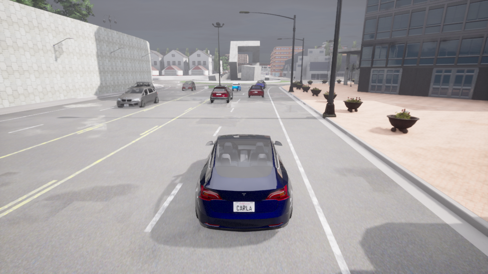
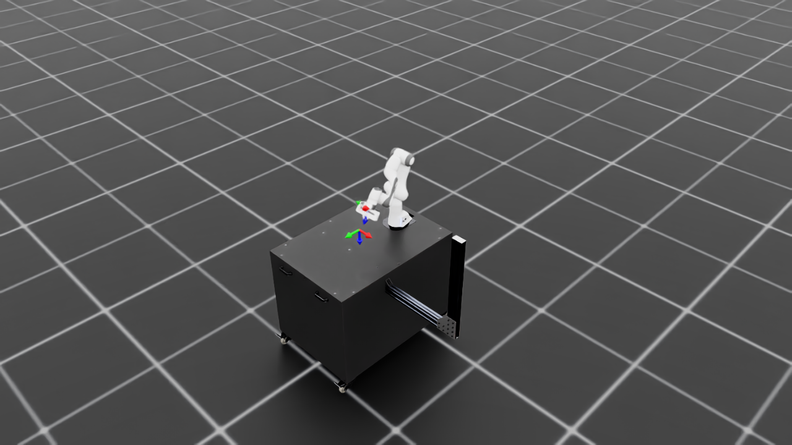

# POMDPPlanners

[](https://opensource.org/licenses/MIT)
[](https://www.python.org/downloads/release/python-3100/)
[](https://github.com/psf/black)

A comprehensive Python package for **POMDP (Partially Observable Markov Decision Process)** planning algorithms and environments. POMDPPlanners provides standardized simulation studies for research and reliable implementations of planning algorithms for industrial applications.

<p align="center">
  
  
</p>
<p align="center">
  <em>Rendered by the package itself: the <a href="POMDPPlanners/environments/carla_pomdp">CARLA</a> driving environment (left) and the <a href="POMDPPlanners/environments/isaac_lab_pomdp">Isaac Sim / IsaacLab</a> Franka reach environment (right). Realistic environments are integrated from the open-source simulators <a href="https://github.com/carla-simulator/carla">CARLA</a> and <a href="https://github.com/isaac-sim/IsaacLab">NVIDIA Isaac Lab</a> — credit to their authors.</em>
</p>

## 🎯 Key Features

- **Comprehensive Algorithm Library**: Implementations of state-of-the-art POMDP planning algorithms including POMCP, POMCPOW, POMCP-DPW, PFT-DPW, Sparse PFT, BetaZero, ConstrainedZero, and more
- **Rich Environment Collection**: Classic and modern POMDP environments (Tiger, Light-Dark, RockSample, LaserTag, PacMan, CartPole, Push, Safety-Ant-Velocity, etc.)
- **Flexible Belief Representations**: Particle filters, weighted beliefs, Gaussian beliefs, Gaussian mixture beliefs, and vectorized belief updaters
- **Simulation Framework**: Complete experiment management with hyperparameter tuning, high-level evaluation workflows, and distributed computing support
- **Visualization Tools**: Built-in plotting and visualization capabilities for analysis and debugging
- **Production Ready**: Designed for both research experiments and industrial applications

## 🚀 Quick Start

### Installation

```bash
# Clone the repository
git clone https://github.com/yaacovpariente/POMDPPlanners.git
cd POMDPPlanners

# Create and activate virtual environment
python -m venv .venv
source .venv/bin/activate  # On Windows: .venv\Scripts\activate

# Install package (standard)
pip install -e .

# Install with development dependencies
pip install -e ".[dev]"
```

### Basic Usage

```python
from POMDPPlanners.environments.tiger_pomdp import TigerPOMDP
from POMDPPlanners.planners.mcts_planners.pomcp import POMCP
from POMDPPlanners.utils.belief_factory import create_environment_belief

env = TigerPOMDP(discount_factor=0.95)
planner = POMCP(environment=env, discount_factor=0.95, depth=20,
                exploration_constant=10.0, n_simulations=1000,
                name="POMCP")
belief = create_environment_belief(env, n_particles=200)

actions, _ = planner.action(belief)
print(f"Recommended action: {actions[0]}")
```

See [Running Experiments](#-running-experiments) below for a parallel
multi-policy evaluation example.

## 📊 Running Experiments

The recommended entry point for end-to-end experiments is `LocalSimulationsAPI`,
which runs parallel episodes, applies persistent caching, and returns aggregated
statistics (mean return, CVaR, VaR, confidence intervals).

```python
from POMDPPlanners.environments import ContinuousLightDarkPOMDPDiscreteActions
from POMDPPlanners.planners.mcts_planners.pomcpow import POMCPOW
from POMDPPlanners.planners.mcts_planners.pft_dpw import PFT_DPW
from POMDPPlanners.utils.action_samplers import DiscreteActionSampler
from POMDPPlanners.utils.belief_factory import create_environment_belief
from POMDPPlanners.simulations.simulation_apis.local_simulations_api import LocalSimulationsAPI
from POMDPPlanners.core.simulation import EnvironmentRunParams

env = ContinuousLightDarkPOMDPDiscreteActions(discount_factor=0.95)
sampler = DiscreteActionSampler(env.get_actions())

pomcpow = POMCPOW(environment=env, discount_factor=0.95, depth=10,
                  exploration_constant=10.0, k_o=2.0, k_a=2.0,
                  alpha_o=0.5, alpha_a=0.5, n_simulations=500,
                  action_sampler=sampler, name="POMCPOW")
pft_dpw = PFT_DPW(environment=env, discount_factor=0.95, depth=10,
                  exploration_constant=10.0, n_simulations=500,
                  action_sampler=sampler, name="PFT_DPW")
belief = create_environment_belief(env, n_particles=200)

api = LocalSimulationsAPI()
_, stats = api.run_multiple_environments_and_policies(
    environment_run_params=[EnvironmentRunParams(
        environment=env, belief=belief,
        policies=[pomcpow, pft_dpw], num_episodes=100, num_steps=30)],
    alpha=0.1, confidence_interval_level=0.95,
    experiment_name="LightDark_Evaluation",
)
```

For hyperparameter search, `LocalSimulationsAPI.run_optimize_and_evaluate(...)`
accepts `HyperParameterRunParams` with Optuna search ranges and forwards the
best configuration to evaluation automatically.

### Progress Tracking and Slack Notifications

Long-running experiments emit lifecycle events (`run_started`,
`episode_completed` heartbeat, `run_finished`, `run_failed`) to a local
SQLite progress DB and, optionally, to Slack. Export `SLACK_WEBHOOK_URL`
before constructing the API and notifications are picked up automatically;
for per-instance control (e.g. routing two parallel simulations to
different channels), pass a `NotificationConfig` directly. An external
watcher CLI catches hard process death (SIGKILL / OOM / reboot) by
monitoring heartbeat age. See
[`NotificationConfig`](POMDPPlanners/simulations/simulations_deployment/run_progress/config.py)
for the full env-var list and watcher invocation.

### Tutorial Notebooks

Self-contained Jupyter notebooks with executable end-to-end examples live in
[`docs/examples/`](docs/examples/):

| Notebook | What it covers |
|---|---|
| [`basic_usage.ipynb`](docs/examples/basic_usage.ipynb) | Environment setup, belief initialization, single-planner evaluation |
| [`planners_comparison.ipynb`](docs/examples/planners_comparison.ipynb) | Side-by-side comparison of POMCP / POMCPOW / PFT-DPW on a shared environment |
| [`belief_representations.ipynb`](docs/examples/belief_representations.ipynb) | Particle, Gaussian, and Gaussian-mixture beliefs |
| [`hyperparameter_tuning.ipynb`](docs/examples/hyperparameter_tuning.ipynb) | End-to-end Optuna search via `run_optimize_and_evaluate` |
| [`advanced_optimization.ipynb`](docs/examples/advanced_optimization.ipynb) | Multi-config tuning, custom search spaces |
| [`custom_environment.ipynb`](docs/examples/custom_environment.ipynb) | Implementing a new `Environment` subclass |

## 🧪 Testing

Run the comprehensive test suite:

```bash
# Activate virtual environment
source .venv/bin/activate

# Run all tests
pytest

# Run specific test categories
pytest POMDPPlanners/tests/test_core/
pytest POMDPPlanners/tests/test_environments/
pytest POMDPPlanners/tests/test_planners/

# Run with verbose output
pytest -v

# Run specific test file
pytest POMDPPlanners/tests/test_core/test_belief.py
```

## 🔧 Development

### Code Quality

```bash
# Format code
black .

# Type checking
python -m pyright POMDPPlanners/

# Run linting
pylint POMDPPlanners/
flake8 .

# Install pre-commit hooks
pre-commit install
```

### Virtual Environment

**Important**: Always activate the virtual environment before development:

```bash
source .venv/bin/activate  # Linux/Mac
# .venv\Scripts\activate   # Windows
```

All commands should be run within this environment for consistent dependency management.

## 📚 Documentation

Comprehensive documentation is generated from docstrings using Sphinx:

```bash
# Build documentation
cd docs/
sphinx-build -b html . _build/html

# Serve locally
python -m http.server 8000 -d _build/html
```

Visit the documentation at: [Project Documentation](https://yaacovpariente.github.io/POMDPPlanners/)

## 📄 License

This project is licensed under the MIT License - see the [LICENSE.md](LICENSE.md) file for details.

## 🎓 Citation

If you use POMDPPlanners in your research, please cite:

```bibtex
@misc{pariente2026pomdpplannersopensourcepackagepomdp,
      title={POMDPPlanners: Open-Source Package for POMDP Planning}, 
      author={Yaacov Pariente and Vadim Indelman},
      year={2026},
      eprint={2602.20810},
      archivePrefix={arXiv},
      primaryClass={cs.AI},
      url={https://arxiv.org/abs/2602.20810}, 
}
```

## 🛠️ Requirements

- Python 3.10 or higher
- Core dependencies managed via `pyproject.toml` (`pip install -e .`)
- Development dependencies: `pip install -e ".[dev]"`

---
