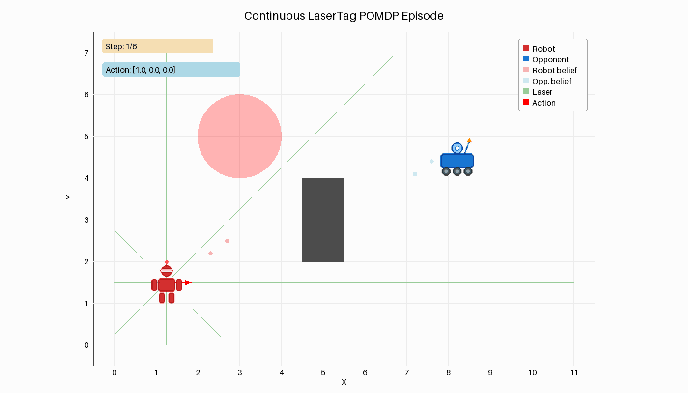
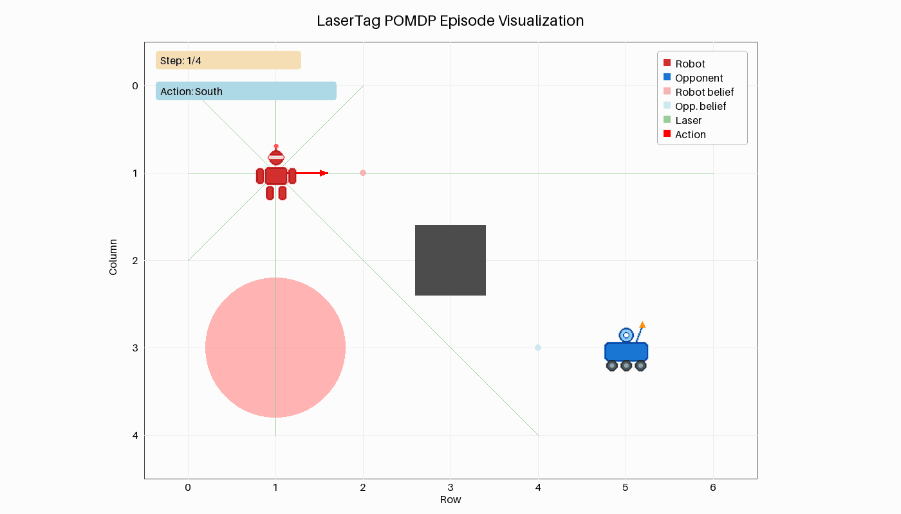

# Cached LaserTag visualization

Historical flat-renderer measurements. The final [visual redesign and current recordings](../lasertag_redesign/README.md) supersede this report, including its legend-overlap limitation.

Both LaserTag variants now copy a cached Pillow background for each frame and draw the recorded state over it. Shared drawing lives in a neutral renderer; continuous geometry and discrete grid rules remain in their own adapters.

Public constructors, the 1400 × 800 canvas, and one-second frame timing are unchanged. Sprites, fonts, legends, and palette change the pixels. Discrete belief marker area still follows probability; continuous support markers stay equally sized. Terminal records remain separate frames.

## Measured before and after

Each row uses the same fixed episode, one warmup, then five complete GIF saves on Ubuntu in Docker. The baseline source is the original renderer at `afbc8c49`. Runtime was Python 3.10.20 and Pillow 12.3.0. Each arm produced identical hashes across all five saves. These small fixtures measure saved GIF cost, not simulation speed.

| Variant | Frames | Before | After | Speedup | Bytes before | Bytes after |
| --- | ---: | ---: | ---: | ---: | ---: | ---: |
| Continuous | 6 | 0.763025 s | 0.089189 s | 8.56× | 115,658 | 195,081 |
| Discrete | 4 | 0.478960 s | 0.062861 s | 7.62× | 99,810 | 111,096 |

The faster saves produce larger files. The four GIFs below are deliberate review artifacts.

| Variant | Before | After |
| --- | --- | --- |
| Continuous |  |  |
| Discrete |  |  |

## Verification and review

- Final source: 362 focused LaserTag tests passed, including both golden comparisons; pyright reported zero errors and 208 warnings; Black 23.12.1 accepted all six changed Python files.
- Earlier snapshot on the same develop base: fresh native build passed, then 6,327 tests passed, 63 skipped, 153 deselected, and 12 expected failures. The default suite excludes slow and benchmark tests. This broad run preceded the final drawing and type fixes; focused checks were repeated afterward.
- One intermediate focused run missed the tolerance in an unchanged native reward parity test. It passed in the broad suite and final repeat. The test seeds NumPy while native code seeds from `std::random_device`; no dynamics or tolerance changed.
- Own review and an independent Claude Code review led to fixes for discrete probability weights, atomic belief drawing, public wall-set compatibility, trail palette colors, and formatting. Final image inspection also restored the vertical axis label so it clears the ticks.

Both golden GIFs were regenerated with fresh native code and all nine frames inspected. The fixed legend can still cover an actor near the upper-right corner; narrow-arena layout was not redesigned.
