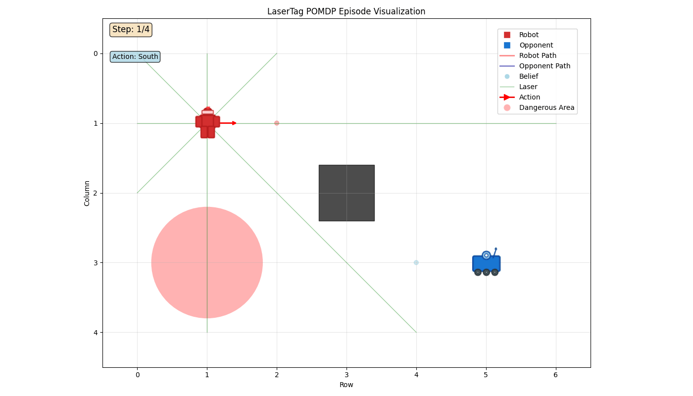
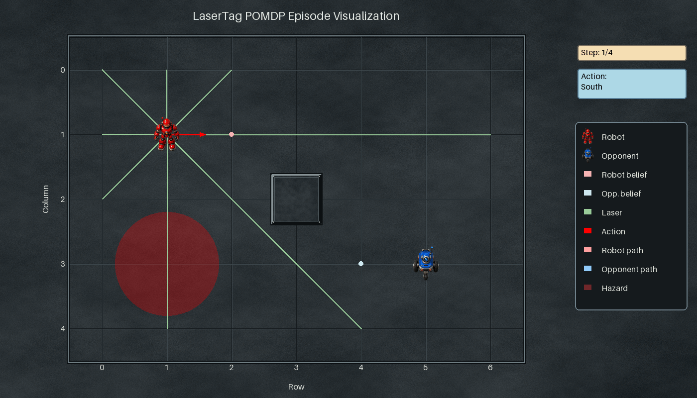
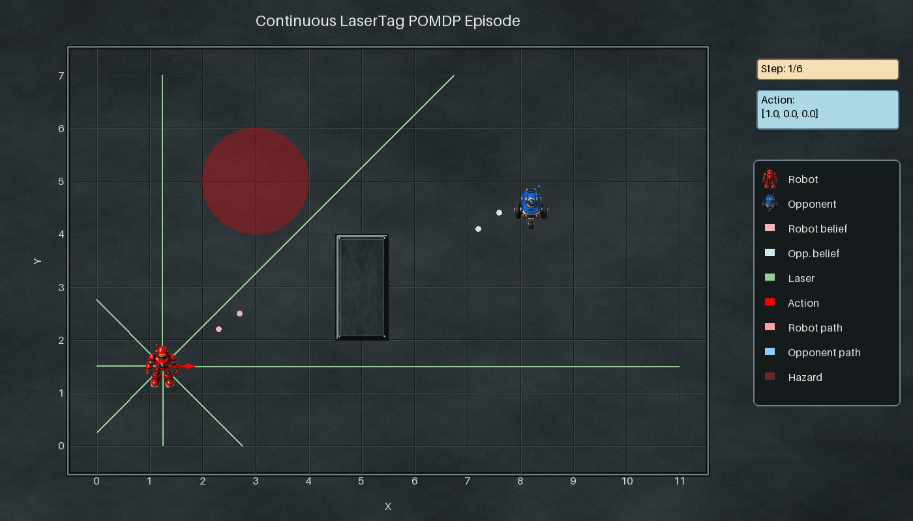
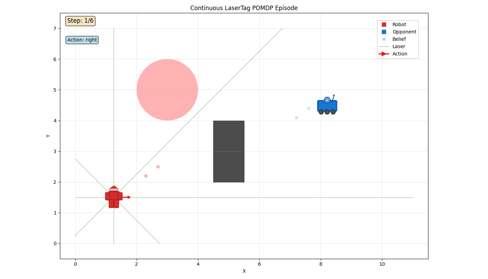

# LaserTag visual redesign

All three variants now use textured steel tiles, raised walls and detailed red/blue robot sprites. The sidebar keeps status and legend out of the arena, fixing the earlier upper-right actor overlap. Rays are easier to see; hazards retain floor texture under their tint.

The shared renderer preserves wall/ray geometry, belief weighting, action and tag rules, clipping, terminal records, 1400 × 800 output and 1,000 ms frames. Cached art and delta-frame GIF encoding keep saving fast. A regression checks every decoded delta frame against its complete quantized source, so smaller files do not leave trails or ghost actors.

## Matched recordings

| Variant | Before | After |
| --- | --- | --- |
| Discrete |  |  |
| Continuous |  |  |
| Continuous, discrete actions |  |  |

Both arms use identical literal histories and seed 42, with four discrete frames and six frames for each continuous variant. The discrete-action variant uses the same continuous visualizer with string actions. `continuous_inputs.py` and `discrete_inputs.py` hold the inputs; `render_variant.py` runs one arm in a fresh process. Baseline visualizers were extracted from develop commit `0111d354`; those files remain unchanged at `bf198976`.

## Saving time

Both arms ran on ubuntu64, Python 3.12.3, Pillow 12.0.0, under the shared compute gate. Warmed values are medians of five complete saves after the first save. Cold values are single fresh-process samples from constructor through first completed save, excluding imports; they are not medians. JSON files record individual timings, dimensions, duration, size and SHA-256.

| Variant | Warm before → after | Cold before → after | Bytes before → after |
| --- | --- | --- | --- |
| Discrete | 0.464 → 0.087 s | 0.510 → 0.284 s | 99,810 → 1,216,132 |
| Continuous | 0.750 → 0.098 s | 0.803 → 0.296 s | 115,658 → 1,351,973 |
| Continuous, discrete actions | 0.743 → 0.101 s | 0.797 → 0.310 s | 112,321 → 1,345,840 |

The richer texture increases GIF size despite delta encoding. These short fixtures measure export cost, not simulation speed or long-episode memory use.

## Art provenance and checks

The packaged sprite sheet was generated with OpenAI image generation for this change: a red metal humanoid robot and blue wheeled camera droid, viewed from above/front. The generated PNG contains a pale checkerboard, despite requested alpha. At first load, cached compiled propagation removes only pale border-connected pixels; it preserves enclosed bright metal highlights. No network call or image generation occurs at runtime. SciPy was already a project dependency. [Enlarged dark/light edge check](asset-edge-review.png) and saved-GIF decoded PNGs accompany the recordings.

- 363 LaserTag tests passed, including alpha, sidebar overlap and exact delta-frame decoding regressions.
- Both golden GIFs were regenerated and their two hash comparisons passed in the actual CI base image on ubuntu64 (Python 3.10.20, Pillow 12.3.0).
- Focused pyright: zero errors or warnings. Black 23.12.1: all four changed Python files clean.
- Built wheel contains the packaged PNG. No local compute fallback or dynamics change.
- Own and independent Claude reviews completed. The review's golden/asset delivery concerns are covered by regenerated CI goldens and explicit PNG inclusion. Its halo claim does not apply: Pillow premultiplies RGBA during resize. Extra sprite resampling is a minor quality note; claimed banding was not found in the decoded frames inspected for the visual gate.

The earlier [flat-renderer report](../lasertag_cached_visualization/README.md) is historical evidence, not the final visual design.
