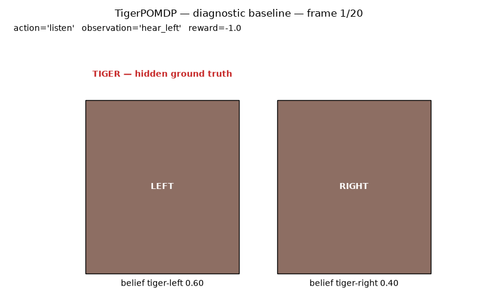
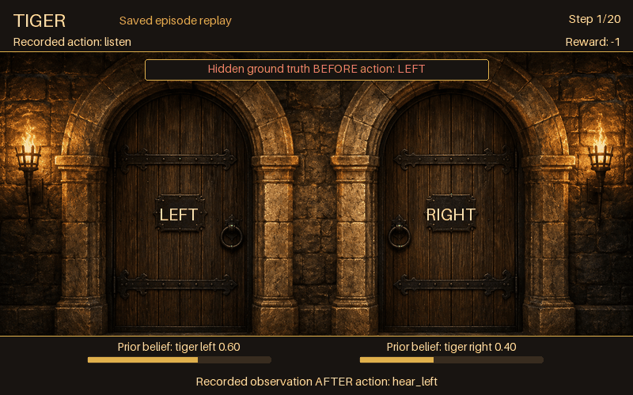
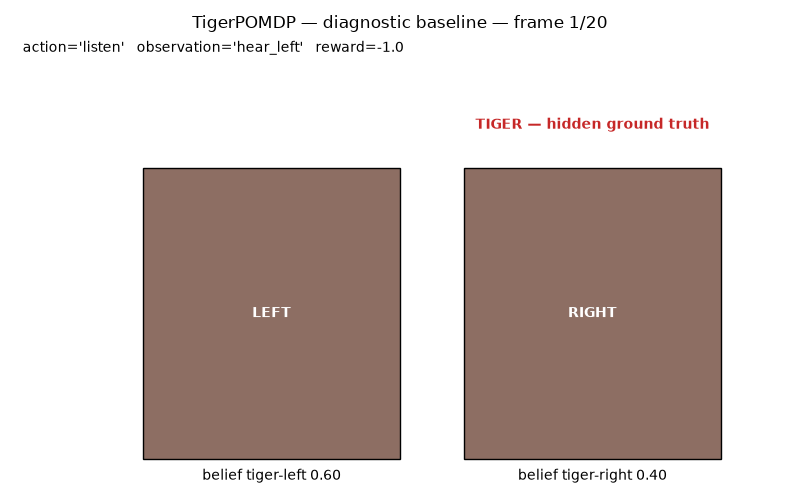

# Tiger episode visualization

Tiger now writes an episode GIF through its normal environment hook. Detailed stone walls, wooden doors and torchlight form a cached background; every changing label is drawn from recorded data.

## Matched before and after

Before is the standalone diagnostic replay from the proposal audit. Develop had no Tiger episode GIF exporter. After is the new package renderer replaying exactly the same saved history. These are not package-renderer speedup comparisons.

| Seed | Standalone diagnostic | New package renderer |
| --- | --- | --- |
| 42 |  |  |
| 43 |  |  |

Both pairs retain 20 frames, 800 × 500 pixels and 500 ms per frame. The capture used 20-particle PFT-DPW histories on ubuntu64, seeds 42/43, source b0baaa37f6a30ab8da01ecda035442bc3f9fe11f. No planner was rerun for this change. The original saved rows and log weights are included as JSON. `replay.py after 42` replays the new renderer; `replay.py before 42` reproduces the Tiger-only diagnostic branch.

The diagnostic labels particle frequencies as belief. The new renderer uses the recorded probability weights, so a weighted belief can differ from the diagnostic frequency. Hidden truth is labeled BEFORE action; noisy recorded observation is labeled AFTER action. Opening outcomes use pre-action state, never the reset successor. The result overlay is labeled ACTION RESULT because the reusable door artwork stays closed.

## Measured saving cost

ubuntu64 was unreachable by both Meshnet hostname and IP. These matched measurements use the registry-permitted local fallback, Yaacovs-MacBook-Air.local, Python 3.12.14/Pillow 12.3.0, one CPU thread. Warm values are medians of five full exports after an untimed warm-up. Cold values are single fresh-process constructor-plus-first-export samples, excluding imports and history loading.

| Seed | New warm | New cold | New bytes | Diagnostic warm | Diagnostic cold | Diagnostic bytes |
| --- | --- | --- | --- | --- | --- | --- |
| 42 | 0.107 s | 0.181 s | 4,145,014 | 0.603 s | 0.615 s | 124,875 |
| 43 | 0.103 s | 0.177 s | 3,964,338 | 0.591 s | 0.614 s | 111,921 |

Each arm produced the same SHA-256 across its five exports. Individual measurements and metadata are in the four JSON files. Detailed texture costs more bytes than the diagnostic's flat shapes. Static art, fonts and one GIF palette are cached; frames use delta encoding with byte-exact decoded-frame tests. Long-history memory use was not benchmarked.

## Art and verification

The chamber PNG was generated with the built-in OpenAI image tool for this change. Prompt: a front-facing torchlit stone chamber with two identical closed wooden doors, detailed grain and iron hardware, blank plaques, no labels, tiger or treasure. It is packaged under the existing POMDPPlanners.environments package; no image API runs during rendering.

- 62 Tiger renderer/environment tests passed in the official CI-base image, including the new fixed golden. Native Mac ran 61 with that Docker-only test skipped. Cases cover weighted and unweighted string beliefs, noisy observations, reset-state outcomes, terminal/truncated histories, RNG preservation, caching and exact saved-frame replay.
- Focused pyright has zero errors or warnings; Black 23.12.1 accepts the three changed Python files.
- Parent inspected actual decoded saved GIFs. The preview PNGs here come from those encoded files.
- An installed wheel exported outside the checkout; both wheel and sdist contain the asset without a redundant MANIFEST entry. Independent review added unweighted-belief support and a fixed golden regression. Docker used local Colima amd64 emulation with one CPU and 3 GB, since ubuntu64 was unavailable; this is distinct from hosted GitHub CI.
