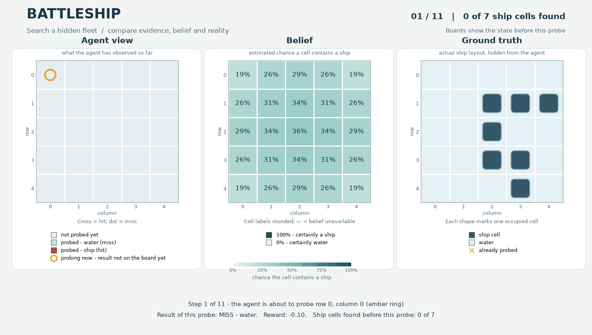

Battleship
==========

``BattleshipPOMDP`` searches for a hidden, fixed fleet on a square board.
Probe one cell at a time and hit every occupied cell to finish. The default
board is 5 by 5, with straight ships of lengths 3, 2 and 2. Ships may touch,
including diagonally, unless ``allow_adjacent_ships=False``.

.. code-block:: python

   from POMDPPlanners.environments.battleship_pomdp import BattleshipPOMDP

   env = BattleshipPOMDP(board_size=5, ship_lengths=(3, 2, 2))

Actions, observations and rewards
---------------------------------

Action ``row * board_size + column`` probes a cell; coordinates start at zero.
The observation is exact: ``1`` for a hit and ``0`` for a miss. Probing changes
only the record of visited cells, never the fleet.

A new hit earns ``hit_reward`` (default 1.0). Water and repeated probes of any
cell earn ``-miss_penalty`` (default -0.1), including another probe of a known
hit. The episode ends when all ship cells have been hit. Reaching the runner's
step limit first is a timeout, recorded separately from completion.

The state contains fleet occupancy and probe flags. Occupancy is hidden from
the agent. ``BattleshipBelief`` tracks legal fleet layouts consistent with
observed hits and misses; its occupancy probabilities describe uncertainty
about each cell. These probabilities are not extra sensor readings.

Recorded visualization
----------------------

The left board shows prior probes: crosses mark hits, dots mark misses, and
pale cells are unprobed. The amber ring marks the current action. The center
board shows recorded belief probabilities on a fixed 0–100% scale. Gray cells
with dashes mean belief data is unavailable. The right board shows the hidden
fleet for human review; the policy does not receive this view. Each ship shape
marks one occupied cell, without assigning ship identities.

Boards show the state before the displayed action. The caption reports that
action's observation and reward separately. The final record has no action
ring and says “Final recorded state”; that label alone does not mean the fleet
was sunk. Frames last 1.4 seconds, with 2.4 seconds for the final record.

This approved package-generated GIF replays 11 records from the seed-7 renderer
fixture, using real transitions and belief updates. It demonstrates the
renderer, not planner performance. The
:download:`contact sheet <../artifacts/battleship_redesign/contact-sheet.png>`
shows six decoded frames. See the
:download:`asset provenance <../artifacts/battleship_redesign/README.md>`
for source and hashes.
