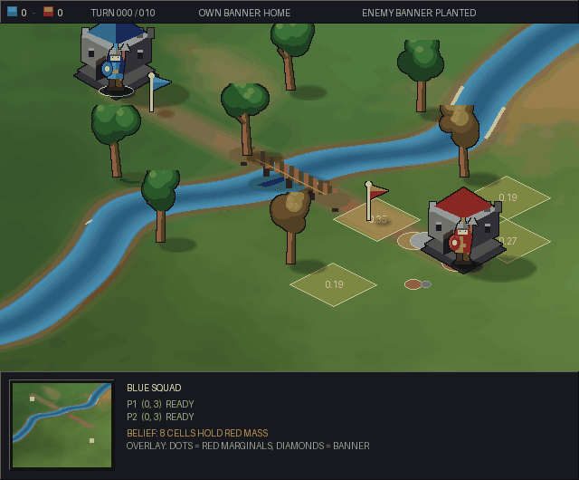

Capture the Flag
================

``CaptureTheFlagPOMDP`` puts two teams on a grid field split by a midline.
Each team has a flag. The planner drives the blue team as one joint
controller; the red team belongs to the transition model and follows a
stochastic role policy. Blue wins by carrying the red flag to the blue base
while its own flag is still home.

Blue never sees the red players, and does not know which of ``K`` candidate
cells holds the red flag. Both are inferred from one observation vector.

.. code-block:: python

   from POMDPPlanners.environments.capture_the_flag_pomdp import CaptureTheFlagPOMDP

   env = CaptureTheFlagPOMDP(grid_size=(9, 7), midline=4, n_blue=2, n_red=2)

State and actions
-----------------

The state carries every player on the field: blue cells, red cells, the red
flag's home cell, a carrier index per flag, a respawn-freeze and a
tagger-cooldown counter per player, and the score. A flag is either at its
home cell or on a carrier's back, because a dropped flag returns home at once,
so one carrier index replaces a second position.

Each player has six actions -- four moves, hold, and scan -- and the planner
issues one joint action for the whole blue team, so the action space is
``6 ** n_blue``: 36 at the default two-a-side. Scan does not move the player;
it widens that player's flag detector for the step and costs more. A move
slips to a perpendicular direction with probability ``slip_probability``, and
a move into a tree or off the field leaves the player where it stood.

One step resolves in a fixed order: blue moves, red moves, flags are picked
up, tags are resolved, scores are awarded, counters tick. The order is
semantics rather than style. Pick-up runs before tagging, so a player tagged
while standing on the flag cell has already taken the flag and therefore drops
it. Both scoring conditions are judged against the same carrier indices, which
keeps blue scoring and red scoring mutually exclusive -- each needs the other
side's flag to be home.

Tagging and respawn
-------------------

A player is tagged when an opponent shares its cell **in the enemy half**, and
only by a tagger that is neither frozen nor on cooldown. Being tagged is a
setback, not a failure: the player returns to its own base, drops any flag it
carried, and is frozen for ``freeze_steps``. The tagger is put on cooldown for
``tagger_cooldown_steps``, which is what stops a defender camping the flag and
tagging repeatedly.

Observations
------------

Blue sees its own team exactly -- positions, freeze counters, who is carrying
-- plus the score and whether its own flag has been taken. It does not see the
red players, the red flag cell, or which red player took its flag.

Each blue player carries a range badge reporting a noisy Manhattan distance to
each red player, correct with probability ``1 - range_error_probability`` and
off by one otherwise, and a binary detector for the red flag cell that fires
with probability ``0.5 * (1 + 2 ** (-d / d0))``. The half-distance ``d0`` is
wider after a scan.

Because every blue player measures every red player, the ``n_blue * n_red``
range readings multiply: moving one red player a single cell changes two of
the four readings at the default team size, costing a factor of 64 in
likelihood. A single flag scan, by contrast, barely separates the candidates.
Strong evidence about where the enemy is, weak evidence about where the flag
is -- that asymmetry is the planning problem.

Rewards and metrics
-------------------

Scoring earns ``capture_reward``; conceding costs ``concede_penalty``. Each
blue player tagged costs ``tagged_penalty``, each red player tagged earns
``tag_reward``, first pick-up earns ``pickup_reward``, and every player pays
its action's cost. None of these exclude each other, so the declared reward
range is the joint worst case rather than the largest single term.

The completion metric is ``task_completion_rate``. Episodes are also split by
why they ended -- ``ended_by_goal_rate``, ``ended_by_failure_rate`` and
``ended_by_timeout_rate`` -- because a completion rate alone cannot tell a
planner taking bad risks from one given too small a step budget. Alongside
episode length, the environment reports tags suffered and inflicted, steps
spent holding the enemy flag, and exposure in the enemy half as both a count
and a per-episode maximum.

Recorded visualization
----------------------

The camera is isometric and the terrain is one continuous procedural field, so
the map reads as a section of a larger world rather than a board. Soldiers
interpolate between cells rather than teleporting, a scan plays its own ping,
and a tagged player is drawn translucent while frozen.

The belief is a separate overlay, never baked into the world art: coloured
markers give each red player's position marginal, sized by probability mass,
and translucent diamonds over the flag candidates carry the marginal over the
red flag's cell. Drawing only the true trajectory would give an MDP picture of
a POMDP -- it could not distinguish a planner that handled uncertainty from
one that got lucky. Particles are drawn rather than summarised by an ellipse,
because a belief over a hidden pursuer routinely goes multi-modal and an
ellipse would hide exactly that.

The environment has no torch vectorized model, so it cannot be run under VOPP.
``PFT_DPW`` runs on the scalar ``Environment`` API.
