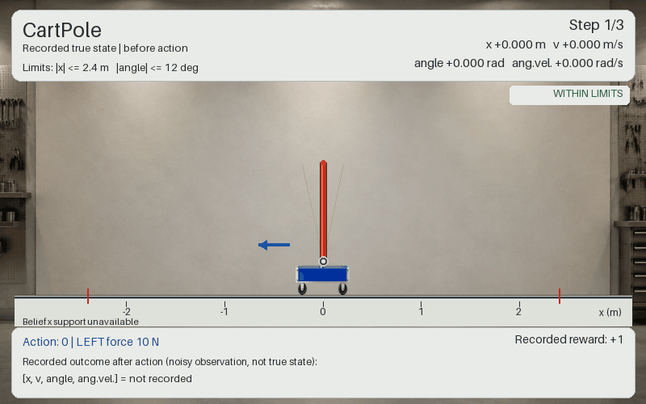

CartPole
========

         belief support, the noisy observation, the reward and the
         within-limits status.
   :width: 800px

   Package-rendered example of three supplied history rows, with recorded
   states ``[x, v, angle, ang.vel.]`` of ``[0, 0, 0, 0]``,
   ``[0.1, -0.1, 0.15, 0.2]`` and ``[0.2, 0.1, -0.22, 0.3]``. The first row
   pushes left, the second pushes right, and the third is the final
   bookkeeping row with no action. Each row draws the true cart and pole, the
   belief's particle support in ``x``, the recorded reward, the noisy
   observation, and whether the state is still within the position and angle
   limits — the last row is outside them. These rows illustrate the renderer,
   not a continuous simulated rollout.

Balance a pole on a cart by pushing left or right, seeing only a noisy reading
of the four-dimensional state. The dynamics are the familiar Gym CartPole; the
partial observability comes from adding Gaussian sensor noise to every
observation.

Use it when you want a continuous-state control problem whose optimal behaviour
you can judge by eye — a good policy survives, a bad one drops the pole in a few
steps — without any of the information-gathering structure of Light-Dark or
RockSample.

What the agent sees and does
----------------------------

- **State** — ``np.ndarray`` of shape ``(4,)``:
  ``[cart_position, cart_velocity, pole_angle, pole_angular_velocity]``. The
  initial state is drawn ``Uniform(-0.05, 0.05)`` in each coordinate.
- **Actions** (discrete) — ``0`` push left, ``1`` push right.
- **Observations** (continuous) — the state plus zero-mean Gaussian noise with
  covariance ``noise_cov``.

Rewards
-------

``+1.0`` for every step in a non-terminal state, ``0.0`` in a terminal one.
``reward_range`` is ``(0.0, 1.0)``. There is no step cost and no goal bonus:
the return is simply how long you survived, discounted.

Key settings
------------

.. list-table::
   :header-rows: 1
   :widths: 34 26 40

   * - Argument
     - Default
     - What it changes
   * - ``discount_factor``
     - *required*
     -
   * - ``noise_cov``
     - *required*
     - Observation noise. This is the knob that sets how partially observable
       the problem is; at zero it degenerates to an MDP.
   * - ``state_transition_cov``
     - ``diag([1e-4, 1e-4, 2.5e-5, 1e-4])``
     - Process noise.

The physics constants are fixed in the class, not constructor arguments:
gravity 9.8, cart mass 1.0, pole mass 0.1, half-pole length 0.5, force
magnitude 10.0, timestep 0.02 s, Euler integration.

An episode ends when ``|cart_position| > 2.4`` or ``|pole_angle| > 0.2094`` rad
(12°).

Minimal example
---------------

.. code-block:: python

   import numpy as np

   from POMDPPlanners.environments.cartpole_pomdp import CartPolePOMDP

   env = CartPolePOMDP(discount_factor=0.95, noise_cov=np.eye(4) * 0.01)

   state = env.initial_state_dist().sample(1)[0]
   push_right = 1
   # With n_samples=1 these return the value itself, not a list of one.
   next_state = env.sample_next_state(state, push_right)
   observation = env.sample_observation(next_state, push_right)
   print(next_state, observation, env.reward(state, push_right))

See also
--------

- :class:`POMDPPlanners.environments.cartpole_pomdp.cartpole_pomdp.CartPolePOMDP`
- Batched torch model:
  ``POMDPPlanners.environments.cartpole_pomdp.cartpole_vectorized_model.CartPoleVectorizedModel``
- :doc:`index` — the full catalog.
