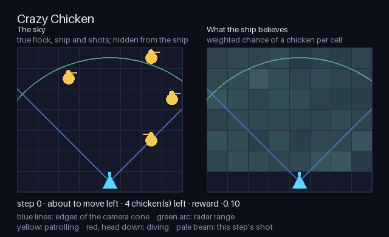

Crazy Chicken
=============

``CrazyChickenPOMDP`` is an arcade shooter written as a POMDP. A ship on row 0
of a grid has to clear a flock of chickens before one of them reaches it. The
default world is 8 columns by 7 rows with 4 chickens and a 60-step budget. The
ship starts in the middle column with an empty sky.

.. code-block:: python

   from POMDPPlanners.environments.crazy_chicken_pomdp import CrazyChickenPOMDP
   from POMDPPlanners.utils.belief_factory import create_environment_belief

   env = CrazyChickenPOMDP()
   belief = create_environment_belief(env, n_particles=200)

Dynamics
--------

Actions are fire, left, right and stay. A move is clamped at the walls. ``FIRE``
launches a projectile only when the cooldown has expired and the ship's own
column holds no projectile; otherwise it behaves exactly like ``STAY`` and costs
nothing, because nothing left the ship.

A projectile rises one row per step and leaves the grid above the top row. At
most one projectile exists per column, which is what makes ``fire_cooldown`` and
the ship's position both matter.

A chicken is either patrolling or diving, and which it is stays hidden. A
patrolling chicken steps one column along its direction and reverses at a wall;
a diving chicken drops one row. Each step every patrolling chicken switches into
a dive with probability ``dive_probability``. The coin is flipped *before* the
chickens move, so a chicken that switches this step also drops this step.

A projectile kills the chicken it reaches, and dies with it. "Reaches" covers
both ending the step in the same cell and swapping past it, so a chicken diving
down through a rising projectile is hit rather than passing through.

A chicken that reaches row 0 in the ship's column destroys it and ends the
episode. One that reaches row 0 anywhere else **pulls up**: it goes back to
patrolling at the top row, keeping its column and direction. That rule is an
addition to the original design proposal, which left the case open. Without it a
dive would either carry the chicken off the grid -- letting the flock clear
itself and making the completion bonus free -- or park it on row 0 where no
projectile can reach it, which is unwinnable.

State and observation contract
------------------------------

The state is ``[step, ship column, cooldown, ship hit, (column, row, direction,
mode, alive) per chicken, projectile row per column]``, so its length is
``4 + 5 * num_chickens + num_columns``. A dead chicken keeps its slot.

An observation is ``[own-column reading, (camera reported, camera offset, radar
reported, radar rows, radar drop) per chicken]``, of length
``1 + 5 * num_chickens``. Every masked field is written as ``0.0``, so two
readings that report the same things compare equal and hash alike; the two
``reported`` flags are what separate a masked zero from a genuine reading of
zero.

The two sensors each give half an answer:

* the **camera** covers a cone opening upward from the ship, with half-slope
  ``camera_slope``. It reports a chicken's *column* offset and says nothing
  about its row.
* the **radar** covers a disc of radius ``radar_radius``. It reports a chicken's
  *row* distance and whether it is dropping, and says nothing about its column.

A chicken inside a sensor's reach is reported with probability
``camera_detection_probability`` or ``radar_detection_probability``; a dead one
or one outside the reach is never reported. Every integer reading is drawn from
a rounded Gaussian

.. math::

   G_\sigma(k; \mu) = \Phi\!\left(\frac{k + 1/2 - \mu}{\sigma}\right)
                    - \Phi\!\left(\frac{k - 1/2 - \mu}{\sigma}\right),
   \qquad k \in \mathbb{Z},

which is the law of ``round(mu + sigma * xi)``. It is not truncated at the grid
edge, so its masses sum to one over all integers and a reading may name a column
that does not exist. Truncating would make the normaliser depend on the hidden
quantity being inferred and would change every likelihood ratio in the belief
update for no gain in realism. ``sigma = 0`` collapses the law to a point mass.

The likelihood multiplies in one factor for **every** chicken slot, not only the
reported ones:

.. math::

   Z(o \mid s') = G_{\sigma_c}(\hat c; c')
                  \prod_{i=1}^{N} q_i^{\text{cam}} \, q_i^{\text{rad}},

where a chicken in reach and reported contributes its detection probability
times the noise mass, one in reach and silent contributes the miss chance, one
out of reach and silent contributes 1, and one out of reach but reported
contributes 0. Silence is therefore evidence: a chicken that a particle places
well inside both sensors, on a step where neither reported it, costs that
particle a factor of ``0.1 * 0.1``. Everything is computed in log space, with an
impossible reading floored rather than set to negative infinity, because
``0 * -inf`` becomes a NaN inside weight normalisation.

Modes and presets
-----------------

``observation_mode="full"`` makes the observation the state itself, for a fully
observable control baseline on identical dynamics and reward.
``noiseless_preset()`` returns the constructor keywords that make every sensor
always report, add no noise and never invert the drop flag, so the observation
becomes a deterministic function of the successor. The transition is untouched:
dives are still drawn, which is what keeps the preset a POMDP whose only
certainty is the reading.

.. code-block:: python

   from POMDPPlanners.environments.crazy_chicken_pomdp import (
       CrazyChickenPOMDP,
       noiseless_preset,
   )

   deterministic_sensors = CrazyChickenPOMDP(**noiseless_preset())
   fully_observable = CrazyChickenPOMDP(observation_mode="full")

Reward and termination
----------------------

+10 per chicken killed, -1 per shot actually fired, -0.1 every step, -50 when a
chicken reaches the ship, +50 when the last chicken dies. The declared reward
range is enumerated rather than estimated: the best step fires nothing, connects
with every projectile in flight and empties the flock, and no step can kill more
than ``min(num_chickens, num_columns)`` chickens because there is at most one
projectile per column and no two chickens start on one cell; the worst step
takes the step cost, a shot that really left the ship, and a ship hit, all three
of which can stack. The clear bonus and the ship hit cannot coincide, because a
chicken that reaches the ship is alive.

``reward_requires_next_state`` is ``True``: kills, the clear bonus and the ship
hit are all decided by the transition. A call without a successor returns only
the part already determined -- the step cost, and the shot cost when the shot
really leaves the ship. That fallback is deliberately not an expectation over
kills, so a planner scoring a belief node still sees firing charged and a
blocked ``FIRE`` charged nothing, while the kill is paid on the step it happens.

An episode ends when the flock is cleared, when a chicken reaches the ship, or
at ``max_steps``.

Belief
------

``CrazyChickenBelief`` is a weighted particle filter with reinvigoration, and it
is what ``create_environment_belief`` returns. The interesting half of the work
is done by the likelihood above rather than by any special code: particles that
put chickens where the sensors would have seen them die off on their own.

What a weight-only filter cannot do is invent a hypothesis it never held, and
two things here need that -- the opening placement is drawn from a large set of
cells that a few hundred particles only partly cover, and a chicken outside both
sensors for several steps drifts away from whichever patrol phase the particles
guessed. After each reweight and resample, a fraction of the particles therefore
have their *unreported* chickens re-drawn: a fresh direction, a fresh mode, and a
one-cell jitter of the position. Chickens the sensors just reported are left
exactly as the weights found them, because perturbing one would throw away the
only hard information the step produced.

Metrics and visualization
-------------------------

``task_completion_rate`` is the fraction of episodes that cleared the flock,
reduced with ``ANY`` -- clearing happens once and ends the episode.
``ended_by_goal``, ``ended_by_failure`` and ``ended_by_timeout`` reduce with
``LAST`` and sum to one per episode. ``average_episode_length``,
``average_chickens_killed`` and ``average_shots_fired`` are per-episode sums.

The danger is a chicken getting close, reported both ways:
``average_hits_taken`` counts the times the flock actually got through, and
``max_chicken_encroachment_cells`` is the severity. The latter is reported as
``max(num_columns - 1, num_rows - 1)`` minus the smallest Chebyshev distance
from the ship to a live chicken, so larger means closer and the distance itself
is recoverable by subtraction. It is reported this way round because the episode
reduction available for a severity is ``MAX`` and there is no ``MIN``.

``shot_accuracy`` is kills per shot. It is the one metric that is not a channel
reduction -- a ratio of two per-episode sums cannot be expressed as a reduction
over a single channel, and a mean of per-step ratios is not the episode's ratio
-- so it is computed in ``compute_metrics`` from the same two channels the
counts are built from. Episodes that never fired are left out of the average
rather than scored as zero.

The left panel is the true world: the ship, the chickens with their mode shown
by the sprite, the projectiles in flight, the edges of the camera cone and the
radar's ring. The right panel is the belief's weighted per-cell chance that a
chicken is there. Drawing the particles themselves is this repository's usual
choice for a low-dimensional state, and the belief here is a particle cloud --
but one particle is a whole flock, and a few hundred overlaid flocks are a smear
rather than a picture. The per-cell marginal is the projection the task turns on
and is still the belief rather than a fit to it. Each frame shows the state a
step was taken from; the caption names the action about to be taken.

Limits
------

There is no torch vectorized model and no C++ model, so VOPP cannot run on this
environment. Scalar ``PFT_DPW`` runs on it directly, which is what the QA gate
uses.
