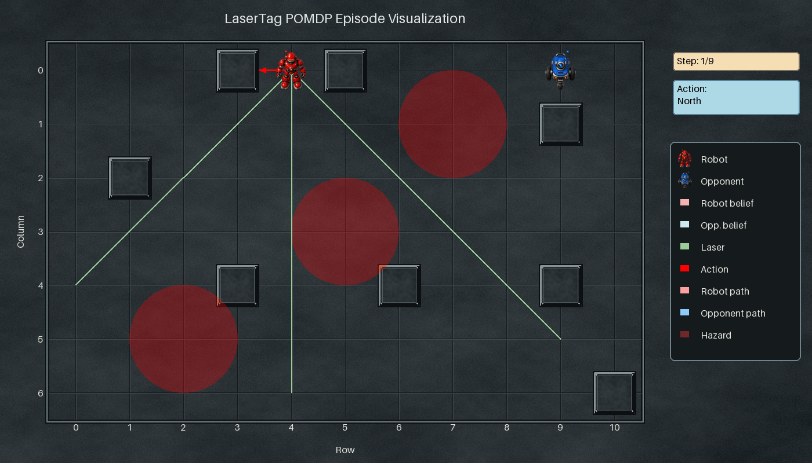
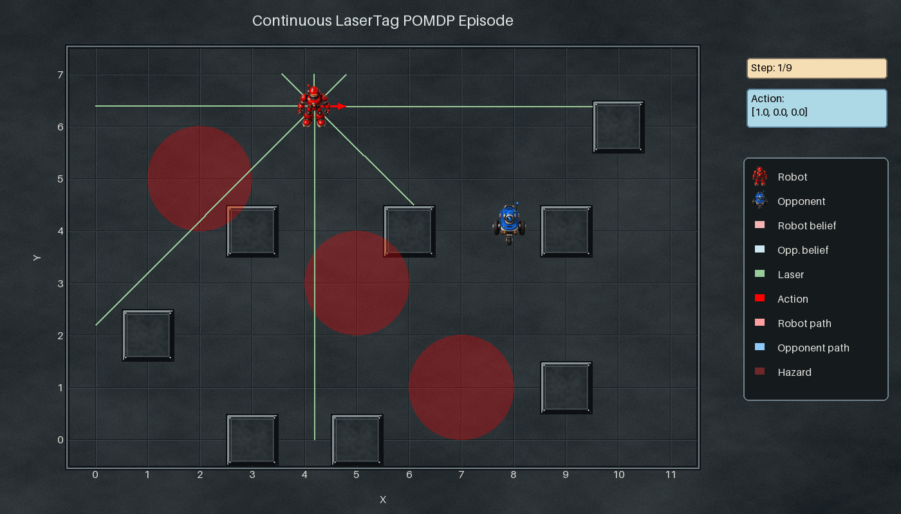

LaserTag
========

Chase an opponent through a walled arena and fire the tag action from its cell.
The only sensor is eight noisy laser ranges, one per compass direction. A ray
stops at a wall **or at the opponent**, so a ray that runs clear along the
opponent's row or column pins it down exactly, while every other configuration
says almost nothing.

That is what makes the problem interesting: information arrives in rare, sharp
bursts rather than continuously. Between sightings the belief spreads out under
the opponent's movement model, so a planner has to decide whether to manoeuvre
for a clean line of sight or to commit to a tag on stale evidence.

Two variants:

- :class:`LaserTagPOMDP
  <POMDPPlanners.environments.laser_tag_pomdp.laser_tag_pomdp.LaserTagPOMDP>` —
  a grid, five discrete actions.
- :class:`ContinuousLaserTagPOMDP
  <POMDPPlanners.environments.laser_tag_pomdp.continuous_laser_tag_pomdp.ContinuousLaserTagPOMDP>`
  — continuous positions, axis-aligned box walls, and a continuous
  ``[dx, dy, tag_flag]`` action. ``ContinuousLaserTagPOMDPDiscreteActions``
  gives that world a five-action set.

What the agent sees and does
----------------------------

- **State** — ``np.ndarray`` of shape ``(5,)``:
  ``[robot_row, robot_col, opponent_row, opponent_col, terminal_flag]`` (grid),
  or the same layout in continuous coordinates.
- **Actions** — grid: integers ``0`` north, ``1`` south, ``2`` east, ``3`` west,
  ``4`` tag. Continuous: ``[dx, dy, tag_flag]``.
- **Observations** (continuous) — eight laser ranges (N, NE, E, SE, S, SW, W,
  NW) with Gaussian noise ``measurement_noise``. The grid variant returns a
  tuple, the continuous one a length-8 ``np.ndarray``. Terminal grid states emit
  ``(-1.0,) * 8``.

The opponent moves with probability 0.4 along x, 0.4 along y and stays with
probability 0.2. Those are nominal weights: when the robot is aligned on an
axis the 0.4 splits 0.2/0.2 across both directions, and a blocked neighbour
folds its mass into "stay", so 0.2 is a floor rather than the actual stay
probability. ``opponent_policy`` selects ``EVADE`` (default; away from the
robot's pre-move position), ``PURSUE``, or ``EVADE_WHEN_SPOTTED``, which only
runs from the robot once a laser has actually seen it.

Rewards
-------

=====================================  =========================================
Event                                  Reward
=====================================  =========================================
Tag on the opponent's cell             ``tag_reward`` (``+10.0``)
Tag and miss                           ``-tag_penalty`` (``-10.0``)
Any move                               ``-step_cost`` (``-1.0``)
Inside a wall or a dangerous area      ``-dangerous_area_penalty`` (``-5.0``)
=====================================  =========================================

.. warning::

   As in PacMan, ``dangerous_area_penalty`` is a **positive magnitude that is
   subtracted**, the opposite of the RockSample and Push convention.

Key settings
------------

.. list-table::
   :header-rows: 1
   :widths: 34 24 42

   * - Argument
     - Default
     - What it changes
   * - ``floor_shape`` (grid)
     - ``(11, 7)``
     - Arena size as ``(rows, cols)``. The module docstring says "7x11"; the
       code says ``(11, 7)``.
   * - ``grid_size`` (continuous)
     - ``(11.0, 7.0)``
     - Arena size as ``(width, height)`` — note the axis order differs from
       ``floor_shape``.
   * - ``walls``
     - 8 fixed cells / box list
     - Layout. Walls both block movement and shape the laser readings.
   * - ``measurement_noise``
     - ``1.0``
     - Laser noise — the partial-observability knob.
   * - ``opponent_policy``
     - ``OpponentPolicy.EVADE``
     - ``PURSUE`` makes the opponent close on the robot; ``EVADE_WHEN_SPOTTED``
       makes it flee only while a laser has line of sight.
   * - ``tag_reward`` / ``tag_penalty`` / ``step_cost``
     - ``10.0`` / ``10.0`` / ``1.0``
     - The impatience trade-off: raise ``tag_penalty`` to punish speculative
       tags.
   * - ``dangerous_areas``
     - ``{(5,3), (7,1), (2,5)}``
     -
   * - ``evasion_speed``
     - ``0.6`` (continuous only)
     -

An episode ends when the terminal flag is set — on a successful tag, or on a
hazard hit when ``is_dangerous_area_hit_terminal=True``.

Minimal example
---------------

.. code-block:: python

   from POMDPPlanners.environments.laser_tag_pomdp import LaserTagPOMDP

   env = LaserTagPOMDP(discount_factor=0.95)

   state = env.initial_state_dist().sample(1)[0]
   north = 0
   next_state = env.sample_next_state(state, north)
   laser_ranges = env.sample_observation(next_state, north)
   print(next_state, laser_ranges)

See also
--------

- Batched torch model:
  ``POMDPPlanners.environments.laser_tag_pomdp.laser_tag_vectorized_model.LaserTagVectorizedModel``
  (grid variant only).
- :doc:`index` — the full catalog.
