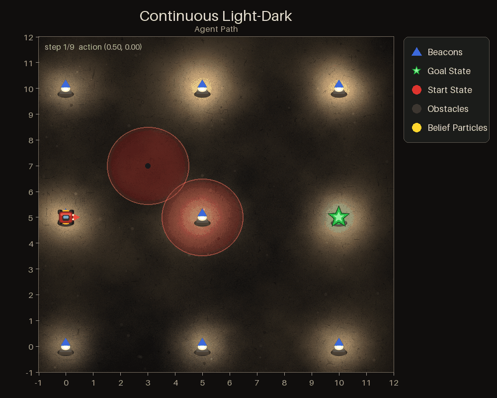

Light-Dark
==========

Navigate to a goal in a world where your position sensor is sharp near beacons
and vague everywhere else. The shortest path is rarely the best one: going the
long way through a beacon buys the localization needed to actually land on the
goal.

This is the cleanest test of whether a planner values information. A planner
optimizing expected reward under a point estimate drives straight at the goal
and misses; one that reasons over beliefs detours.

Two variants ship, sharing the same reward shape:

- :class:`ContinuousLightDarkPOMDP
  <POMDPPlanners.environments.light_dark_pomdp.continuous_light_dark_pomdp.ContinuousLightDarkPOMDP>`
  — continuous 2-D position, continuous action, continuous observation.
- :class:`DiscreteLightDarkPOMDP
  <POMDPPlanners.environments.light_dark_pomdp.discrete_light_dark_pomdp.DiscreteLightDarkPOMDP>`
  — integer grid, four moves, grid-cell observations.

There is also ``ContinuousLightDarkPOMDPDiscreteActions``: the continuous world
with the four discrete moves, for planners that need a finite action set. Note
its noise defaults differ — ``np.eye(2)`` rather than ``np.eye(2) * 0.05``.

Continuous variant
------------------

- **State** — ``np.array([x, y])``. Because ``is_obstacle_hit_terminal``
  defaults to ``True``, a third terminal-flag slot is appended, so states are
  3-D by default.
- **Actions** (continuous) — a displacement ``np.array([dx, dy])``. The next
  state is ``state + action + N(0, state_transition_cov_matrix)``. No bound on
  the step is enforced.
- **Observations** (continuous) — noisy position. The covariance is halved
  within ``beacon_radius`` of any beacon. Three models are selectable through
  ``observation_model_type``: ``NORMAL_NOISE``, ``NORMAL_NOISE_NO_OBS_IN_DARK``
  and ``DISTANCE_BASED``.

Discrete variant
----------------

- **State** — ``np.array([x, y])`` on an integer grid.
- **Actions** (discrete) — ``"up"``, ``"down"``, ``"right"``, ``"left"``.
- **Observations** (discrete) — a grid cell: the true cell with probability
  ``1 - error``, otherwise a neighbour. The error is
  ``observation_error_prob * 0.2`` near a beacon and ``observation_error_prob``
  away from one.
- Its ``observation_model_type`` is a *different* enum, with members ``NORMAL``,
  ``NO_OBS_IN_DARK`` and ``DISTANCE_BASED``.
- ``reward_range`` is ``None`` on this class — it does not declare one.

Rewards
-------

Both variants start from ``-fuel_cost - ||next_state - goal||`` and then follow
an **ordered chain** — the first branch that matches wins, so the terms never
stack:

.. code-block:: text

   base = -fuel_cost - ||next_state - goal||

   inside the goal radius   ->  base + goal_reward
   else on an obstacle      ->  base            (the hazard penalty is applied
                                                 separately, via the hazard draw)
   else outside the grid    ->  base + obstacle_reward
   otherwise                ->  base

Defaults: ``fuel_cost=2.0``, ``goal_reward=10.0``, ``obstacle_reward=-10.0``,
``obstacle_hit_probability=0.2``.

.. note::

   A step that leaves the grid can pay less than the declared ``reward_range``
   minimum on the continuous variant. This is known, documented in the source,
   and covered by a strict xfail test — do not treat it as a new bug.

Key settings
------------

.. list-table::
   :header-rows: 1
   :widths: 34 22 44

   * - Argument
     - Default
     - What it changes
   * - ``grid_size``
     - ``11``
     - World extent.
   * - ``beacons``
     - 9 points on a 3×3 lattice
     - Where localization is cheap. Removing beacons makes the problem harder.
   * - ``start_state`` / ``goal_state``
     - ``[0, 5]`` / ``[10, 5]``
     -
   * - ``goal_state_radius`` (continuous only)
     - ``1.5``
     - How precisely you must arrive. Shrink it to force a beacon detour. The
       discrete variant has no such argument — it terminates on exact cell
       equality with ``goal_state``.
   * - ``obstacles``
     - ``[(3, 7), (5, 5)]``
     -
   * - ``state_transition_cov_matrix``
     - ``np.eye(2) * 0.05``
     - Motion noise (continuous variant).
   * - ``observation_cov_matrix``
     - ``np.eye(2) * 0.05``
     - Sensor noise away from a beacon (continuous variant).
   * - ``is_obstacle_hit_terminal``
     - ``True`` (continuous), ``False`` (discrete)
     - On the continuous variant, whether an obstacle ends the episode. On the
       discrete variant it chooses *which* termination rule applies, not
       whether: ``False`` is the legacy behaviour where obstacles are
       **always** terminal, ``True`` makes them Bernoulli-terminal through the
       hazard draw and adds the terminal slot.

An episode ends at the goal — inside ``goal_state_radius`` on the continuous
variant, on the exact cell on the discrete one — or on an obstacle hit under
the rule above. Leaving the grid is penalized but not terminal.

Minimal example
---------------

.. code-block:: python

   import numpy as np

   from POMDPPlanners.environments.light_dark_pomdp.continuous_light_dark_pomdp import (
       ContinuousLightDarkPOMDP,
   )

   env = ContinuousLightDarkPOMDP(discount_factor=0.95)

   state = env.initial_state_dist().sample(1)[0]
   step_right = np.array([1.0, 0.0])
   next_state = env.sample_next_state(state, step_right)
   observation = env.sample_observation(next_state, step_right)
   print(state[:2], "->", next_state[:2], "seen as", observation)

See also
--------

- Batched torch model:
  ``POMDPPlanners.environments.light_dark_pomdp.continuous_light_dark_vectorized_model.ContinuousLightDarkVectorizedModel``
  (continuous variant only — the discrete one has none).
- :doc:`index` — the full catalog.
