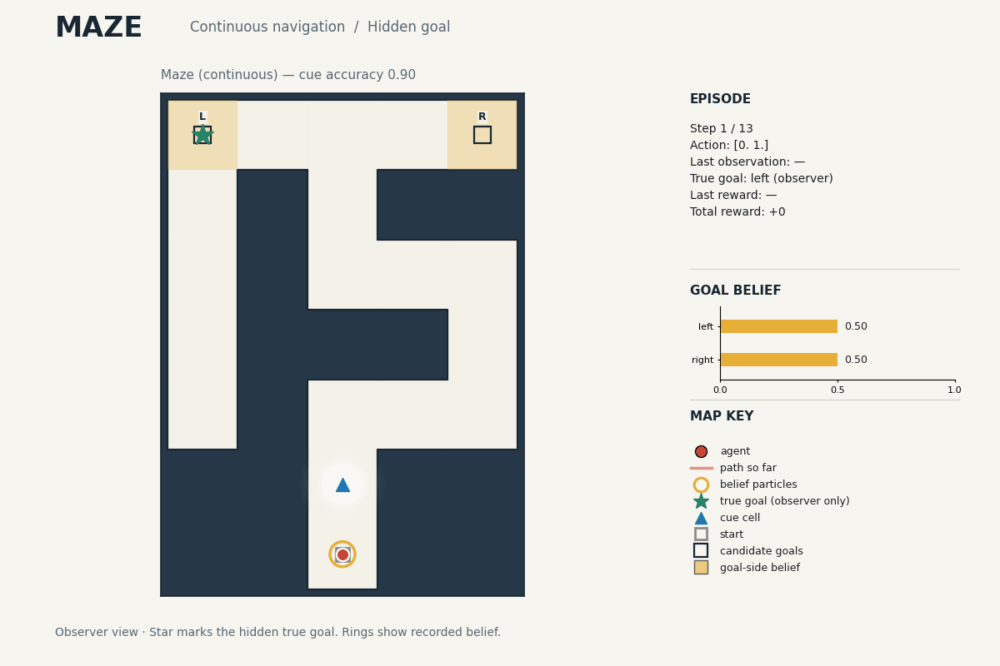
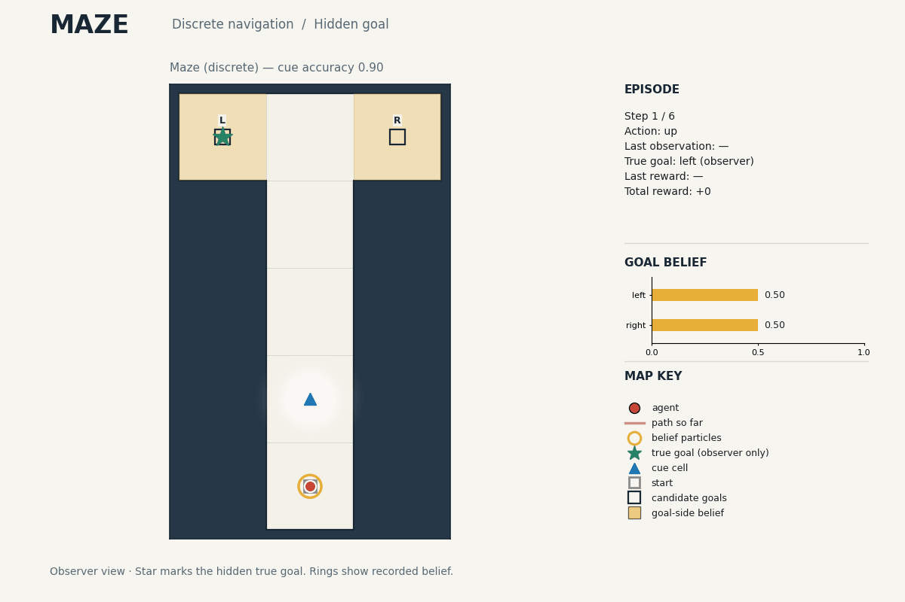

Maze
====

These three environments test memory of a noisy, single-use cue. The map is
known and movement is deterministic; only the rewarding goal side is hidden.
Entering either goal ends the episode, but only the correct goal counts as
success. The cue names that side with probability ``cue_accuracy``; later
observations are ``empty``.

DiscreteMazePOMDP
-----------------

``DiscreteMazePOMDP`` uses integer cell positions in a generated maze. The
four actions, ``up``, ``down``, ``left`` and ``right``, move one cell; a wall
blocks the move. ``maze_width``, ``maze_height``, ``maze_seed`` and
``loop_fraction`` control the layout.

   DiscreteMazePOMDP: one-cell moves through a generated maze.

ContinuousMazePOMDP
-------------------

``ContinuousMazePOMDP`` uses real-valued positions and displacement actions
``[dx, dy]``, capped in length by ``max_step_size``. Collision checks cover
the whole movement path. With the same layout settings as DiscreteMazePOMDP,
it uses the same maze geometry.

   ContinuousMazePOMDP: bounded displacements through a generated maze.

TMazePOMDP
----------

``TMazePOMDP`` uses a T-shaped corridor and the same four one-cell actions as
the discrete maze. ``stem_length`` sets the distance to the junction and
``arm_length`` sets the distance from the junction to each endpoint. The
agent must remember the cue while walking up the stem, then choose an arm.

   TMazePOMDP: remember the cue until the left-or-right choice at the junction.

The images above are package-generated golden visualizations, copied unchanged
from the environment visualization test fixtures. They illustrate recorded
histories, not planner performance comparisons.

Create a visualization
----------------------

All three variants share a renderer for reviewing recorded episodes. The GIF is 1200 by 800 pixels and advances every 500 ms.

.. code-block:: python

   from pathlib import Path
   from POMDPPlanners.environments.maze_pomdp import MazeVisualizer

   # Use the environment and History returned by the simulation workflow.
   MazeVisualizer(environment).create_visualization(
       episode.history, Path("maze-review.gif")
   )

Read a frame
------------

The red dot is the recorded position; the red line joins earlier positions.
Ivory cells are walkable. Slate regions and their outlines are walls. Discrete
mazes have cell guides; continuous positions are drawn without rounding.

The blue triangle marks the cue cell. The open square marks the start. L and R
identify the candidate goals. The green star shows the true goal for the human
observer; this is hidden from the policy.

Amber rings show recorded position particles, sized by weight. Endpoint tints
and the left/right bars show the recorded probability of each goal. A missing
belief is labeled ``unavailable``.

The action belongs to the displayed state. Last observation and last reward
come from the preceding transition, so the first frame has neither. Total
reward is the undiscounted sum of completed transitions. The final state needs
a terminal record, as supplied by the simulation workflow.

The public ``MazeVisualizer`` import and legacy ``TMazeVisualizer`` alias are
unchanged. The renderer isolates its style from the caller's matplotlib theme.
