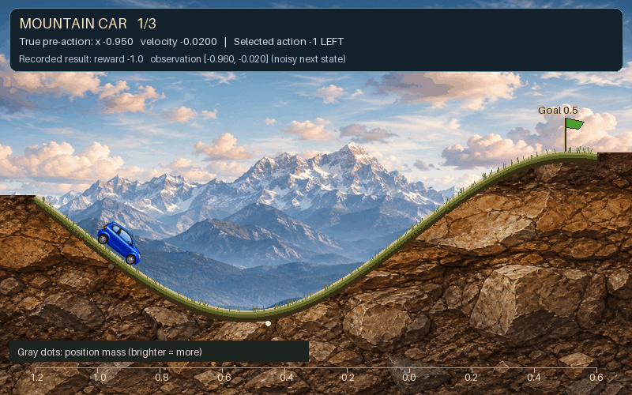

Mountain Car
============

   Package-rendered example of three supplied history rows, with recorded
   states ``[position, velocity]`` of ``[-0.95, -0.02]``, ``[-0.15, 0.03]``,
   and ``[0.50, -0.01]``. The first two rows show noisy observations and
   particle then Gaussian beliefs; the last is a terminal row at the goal.
   These rows illustrate the renderer, not a continuous simulated rollout.

The classic underpowered car: it cannot climb the hill directly and must rock
back and forth to build momentum, while reading position and velocity through
noise.

The long horizon and the sparse, purely negative reward make it a hard problem
for short-horizon search: a planner that cannot see past its horizon never
discovers that reversing first is what wins.

What the agent sees and does
----------------------------

- **State** — ``[position, velocity]``, position in ``[-1.2, 0.6]``, velocity in
  ``[-0.07, 0.07]``, with process noise ``diag([2.5e-5, 1e-6])``.
- **Actions** (discrete) — ``-1``, ``0``, ``1``.
- **Observations** (continuous) — noisy ``[position, velocity]``, standard
  deviations 0.1 and 0.01.
- **Rewards** — ``-1.0`` per step, ``0.0`` once ``position >= 0.5``.
  ``reward_range`` is ``(-1.0, 0.0)``; the episode ends at the goal. It reports
  a ``goal_reaching_rate`` metric.

Formal definition
-----------------

Write the state as :math:`s = (p, v)`.

.. math::

   S = [-1.2,\, 0.6] \times [-0.07,\, 0.07], \qquad
   A = \{-1, 0, 1\}, \qquad \Omega = \mathbb{R}^2

**Transition model.** The deterministic part is the standard Mountain Car
map, with power :math:`\rho = 0.001` and gravity :math:`g = 0.0025`:

.. math::

   \tilde{v} &= \mathrm{clip}\big(v + a\rho - g\cos(3p),\; -0.07,\; 0.07\big) \\
   \tilde{p} &= \mathrm{clip}(p + \tilde{v},\; -1.2,\; 0.6) \\
   f(s, a) &= \begin{cases}
     (\tilde{p},\, 0) & \tilde{p} = -1.2 \text{ and } \tilde{v} < 0 \\
     (\tilde{p},\, \tilde{v}) & \text{otherwise}
   \end{cases}

The left wall is inelastic: hitting it zeroes the velocity. Gaussian process
noise is then added and the result projected back into :math:`S` by the same
clipping rule :math:`\Pi`:

.. math::

   s' = \Pi\big(f(s, a) + \varepsilon\big), \qquad
   \varepsilon \sim \mathcal{N}(0, \Sigma_T), \qquad
   \Sigma_T = \mathrm{diag}(2.5 \times 10^{-5},\; 10^{-6})

:math:`\Sigma_T` is the ``state_transition_cov`` constructor argument.

.. note::

   ``transition_log_probability`` returns the *unprojected* density
   :math:`\log \mathcal{N}(s'; f(s,a), \Sigma_T)`. At the boundary that
   density is not the density of the projected variable, which puts positive
   mass on the walls. It matters only for beliefs pressed against a wall.

**Observation model.** The full state, read through independent noise:

.. math::

   O(o \mid s', a) = \mathcal{N}(o;\, s',\, \Sigma_O), \qquad
   \Sigma_O = \mathrm{diag}(0.1^2,\; 0.01^2)

The action does not enter. Position noise of :math:`0.1` against a domain of
width :math:`1.8` is what makes this a POMDP rather than Mountain Car.

**Reward function.** One unit of cost per step until the goal:

.. math::

   R(s, a) = -\mathbb{1}[p < 0.5]

so :math:`R \in [-1, 0]`.

**Initial belief.** Position uniform on a band around the valley floor,
velocity exactly zero:

.. math::

   b_0 = \mathrm{Unif}([-0.6,\, -0.4]) \otimes \delta_0

with the initial observation reported as :math:`(0, 0)` rather than sampled
from :math:`O`.

**Discount.** :math:`\gamma` = ``discount_factor``, required.

**Terminal set.** :math:`S_T = \{(p, v) \in S : p \geq 0.5\}`.

Minimal example
---------------

.. code-block:: python

   from POMDPPlanners.environments.mountain_car_pomdp.mountain_car_pomdp import (
       MountainCarPOMDP,
   )

   env = MountainCarPOMDP(discount_factor=0.99)
   state = env.initial_state_dist().sample(1)[0]
   next_state = env.sample_next_state(state, 1)
   print(state, next_state, env.sample_observation(next_state, 1))

See also
--------

- :class:`POMDPPlanners.environments.mountain_car_pomdp.mountain_car_pomdp.MountainCarPOMDP`
- :doc:`sanity` — the other small debugging environment.
- :doc:`index` — the full catalog.
