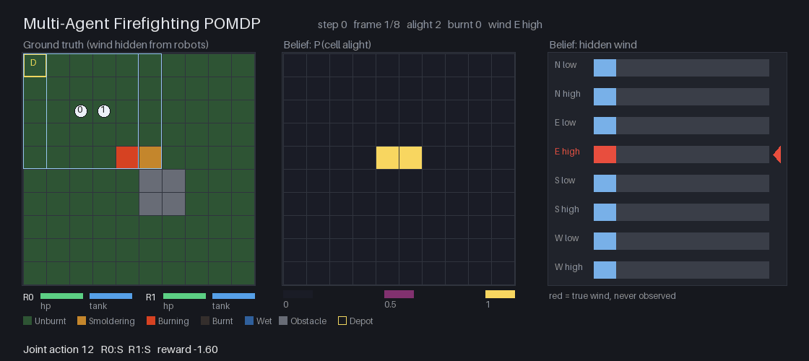

Multi-agent firefighting
========================

``MultiAgentFirefightingPOMDP`` puts ``N`` firefighting robots on an ``R x C``
grid and asks them to put out a fire that spreads under a **hidden, constant
wind**. The default world is 10 by 10 with two robots, one small obstacle blob
just past the middle, and a depot in the north-west corner. The robots see the
fire only near themselves, carry a finite tank of suppressant, and take heat
damage for standing in flames. The task is complete when no cell is burning.

.. code-block:: python

   from POMDPPlanners.environments.multiagent_firefighting_pomdp import (
       MultiAgentFirefightingPOMDP,
   )
   from POMDPPlanners.utils.belief_factory import create_environment_belief

   env = MultiAgentFirefightingPOMDP()
   belief = create_environment_belief(env, n_particles=100)

World and state
---------------

Every cell holds one of five categories: ``UNBURNT`` (has fuel), ``SMOLDERING``
(intensity 1), ``BURNING`` (intensity 2), ``BURNT`` (fuel consumed) and ``WET``
(soaked, cannot reignite). ``BURNT`` and ``WET`` are absorbing, and no rule maps
either back into an alight category. That is what makes "no cell is alight"
a genuine terminal state rather than a moment that can be undone, and therefore
what makes the completion metric mean anything.

The hidden wind is a direction in ``{N, E, S, W}`` crossed with a strength in
``{low, high}`` -- eight values, drawn uniformly at reset and constant for the
episode. It is never observed.

The state is one ``float64`` vector of length ``3 + 4N + R*C``::

    [step, (row, col, tank, health) x N, wind_direction, wind_strength, cells]

A robot's tank holds ``max_tank`` sprays (6 by default) and its health starts at
``max_health`` (3 by default). At zero health a robot is disabled: its digit of
the joint action is ignored and it sees nothing for the rest of the episode.

Actions
-------

Each robot has five actions -- ``NORTH``, ``EAST``, ``SOUTH``, ``WEST`` and
``SUPPRESS``. The environment receives one centralized joint action: a single
integer whose base-5 digits are the per-robot actions, least significant digit
first. Two robots give 25 joint actions, three give 125.

A move is refused by the grid edge, by an obstacle and by a ``BURNT`` cell, and
an otherwise admissible move fails with ``slip_probability`` (0.05 by default).
``SUPPRESS`` costs one tank unit and covers the robot's own cell *and its four
neighbours* -- which is the point of the design: a careful planner fights from
an adjacent cell and takes no damage, a careless one stands in the fire. An
``UNBURNT`` target becomes ``WET``, which is how a firebreak is built ahead of
the front. A robot with an empty tank does nothing and pays nothing. Entering
the depot refills the tank, with no separate action, so ``|A|`` stays at
``5 ** N``; a robot that sprays and steps into the depot on the same step ends
the step full.

Transition
----------

Six stages resolve in a fixed order, and the order is not cosmetic.

1. **Motion.** Admissible moves succeed with ``1 - slip_probability``.
2. **Suppression.** A cell covered by ``m`` sprays becomes ``WET`` with
   ``1 - (1 - q)^m``, where ``q`` depends on the cell's category: 1.0 unburnt,
   0.9 smoldering, 0.6 burning, 0 for burnt and wet. Burning resists one hose,
   which is why two robots on one cell are worth more than two robots dividing
   the work -- this is the only place in the model where they genuinely
   cooperate. Resolving suppression *before* spread is what lets a robot stop a
   front by soaking the cell ahead of it in the same step.
3. **Spread.** An unburnt cell catches unless every alight four-neighbour fails
   to ignite it. The one neighbour sitting directly upwind ignites it at
   ``min(1, spread_probability * gain)``; the other three at
   ``spread_probability * (1 - crosswind_attenuation)``. The gain is
   ``wind_gain_low`` (2.0) or ``wind_gain_high`` (3.5). That asymmetry is the
   whole reason the wind is identifiable: with no asymmetry the hidden wind
   would be unobservable noise rather than something to infer.
4. **Growth and burnout**, applied only to cells already alight *before* the
   spread stage, so a cell cannot ignite and reach full intensity in one step.
   Smoldering grows to burning with ``growth_probability``; burning burns out to
   ``BURNT`` with ``burnout_probability``.
5. **Heat damage.** A robot loses 1 health on a smoldering cell and 2 on a
   burning one. With the default health of 3 it survives one burning step and is
   disabled by the second.
6. **Bookkeeping.** The step counter advances and the wind is copied unchanged.

Spread and burnout defaults
---------------------------

``spread_probability`` defaults to **0.10** and ``burnout_probability`` to
**0.03**, and the pair was measured rather than proposed. At the originally
drafted 0.06 and 0.12 an *unattended* fire on the default world went out by
itself in 93% of episodes: a planner that did nothing would have "completed the
task" nine times in ten, and no margin over a random baseline would have been
measurable. At 0.10 and 0.03 the same unattended fire goes out 6% of the time, a
uniformly random policy 27%, and a hand-written greedy firefighter 89%, so the
completion rate reports what the planner did.

Observation
-----------

An observation is one ``float64`` vector of length ``4N + R*C``::

    [(row, col, tank, health) x N, reported category per cell]

Poses, tanks and healths are exact. Every cell within Chebyshev radius
``sensing_radius`` (2 by default) of any *live* robot reports its true category
with probability ``1 - observation_error_probability`` and one of the other four
uniformly otherwise. Every other cell reports ``-1``, the unknown marker, so the
observation has a fixed shape whatever the robots do. Two robots standing
together see barely more than one, so spreading out is what buys information.

The wind never enters the observation. It is observable only through its effect
on the fire, which is what makes this an inference problem rather than a lookup.
Both the transition and the observation density are available in closed form:
``transition_log_probability`` is exact, because the intermediate map is
recoverable from the pair of maps -- wet is reachable only by suppression, burnt
only by burnout, and a freshly ignited cell cannot also grow.

Reward and termination
----------------------

Every term reads the realised successor, so
``reward_requires_next_state`` is ``True``.

.. list-table::
   :header-rows: 1
   :widths: 30 70

   * - Term
     - Value
   * - step cost
     - ``-step_cost`` (0.1) on every transition, the terminating one included
   * - active fire
     - ``-(0.5 * smoldering + 1.0 * burning)`` cells in the successor
   * - property loss
     - ``-5.0`` per cell newly burnt this step
   * - robot damage
     - ``-10.0`` per point of health lost, deliberately above the cell cost so
       a planner does not trade a robot for a cell
   * - suppressant
     - ``-0.1`` per robot that actually sprayed
   * - success
     - ``+100.0`` on the transition into a fire-free state

The declared reward range is computed from the constructor's own coefficients,
grid size and robot count -- never a constant. The **maximum** is
``success_reward - step_cost``, not ``success_reward``, because the step cost is
charged on the terminating transition too. The **minimum** is::

    -(step_cost
      + max(smoldering_cell_cost, burning_cell_cost, burnt_cell_cost) * R * C
      + damage_cost * N * min(max_health, 2)
      + water_cost * N)

A cell in the successor is smoldering, or burning, or newly burnt, or none of
those -- never two at once -- so those three terms share one budget of ``R * C``
cells rather than stacking, which is what allows the ``max`` instead of a sum.
With the defaults that is ``(-540.3, 99.9)``.
``is_all_robots_disabled_terminal`` changes only termination, so it moves
neither end of the bound.

Termination is evaluated in this order: **goal** (no cell alight), **failure**
(every robot disabled while fire is still active, when
``is_all_robots_disabled_terminal``), then **timeout** (``max_steps``, 100 by
default). Goal wins over failure, so a fire put out by robots that then burned
out is still a success.

Metrics and visualization
-------------------------

``task_completion_rate`` reports a fire-free map, reduced with ``ANY``: wet and
burnt are absorbing, so a fire-free map cannot be undone and ``ANY`` and
``LAST`` agree. ``ended_by_goal``, ``ended_by_failure`` and ``ended_by_timeout``
report how each episode ended and sum to one. ``average_episode_length`` is a
constant channel summed.

The danger is reported both as a count -- ``robot_steps_in_fire``,
``robot_health_lost`` -- and as a severity --
``max_simultaneous_alight_cells``, ``max_burnt_cell_fraction``. A planner that
lets the fire reach forty cells and then beats it out is not the same as one
that never let it past five, and the totals alone would not distinguish them.
``suppressant_units_used`` and ``robots_disabled_at_end`` round out the picture.

The left panel is the truth: the five categories, the obstacles, the depot, each
live robot with its health and tank badge and its sensing footprint, and the
true wind printed and labelled hidden. The middle panel is the per-cell
probability that the cell is alight, as the weighted mean over the belief's
particles -- the exact marginal, not a summary. The right panel is the total
particle weight on each of the eight wind values, with the true one marked in
red. A firefighting run is unreadable without that last panel: you cannot tell
a planner that inferred the wind from one that guessed.

Filtering and limits
--------------------

There is **no torch vectorized model and no C++ native model**, so VOPP is
unsupported and the environment is deliberately absent from the vectorized
config contract. ``PFT_DPW`` takes the scalar API directly.

There is no dedicated belief class either; the generic weighted particle filter
suffices, since the observation likelihood is closed form. Be aware of what that
costs. A bootstrap filter over whole 100-cell maps is high-dimensional, and with
a flat prior over where the fire started it is degenerate: no prior particle
matches the observed front, every weight lands on the epsilon floor, and both
belief panels render as noise. Seed the particles with what the robots actually
know at reset, use enough of them, and inspect effective sample size rather than
trusting the wind histogram on sight. The wind itself *is* identifiable from the
spread -- an exact posterior over the eight values, given the map, puts most of
its mass on the true wind within about twenty-five steps -- so a flat histogram
late in an episode is a statement about the filter, not about the environment.
