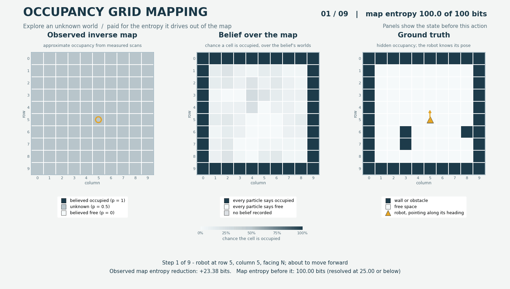

Occupancy grid mapping
======================

``OccupancyGridMappingPOMDP`` models a robot mapping a hidden static grid with
known pose and noisy range scans. The default world is 10 by 10 cells with a
boundary wall and three random rectangular obstacles. The robot starts at the
centre, facing north. Actions are forward one cell, turn left and turn right.
Integer pose is a design simplification; particle-based MCTS also supports
continuous states.

.. code-block:: python

   from POMDPPlanners.environments.occupancy_grid_mapping_pomdp import (
       OccupancyGridMappingPOMDP,
   )
   from POMDPPlanners.utils.belief_factory import create_environment_belief

   env = OccupancyGridMappingPOMDP()
   belief = create_environment_belief(env, n_particles=30)

State and observation contract
------------------------------

The state contains the step, row, column, heading, hidden true occupancy,
observation-derived map log-odds, and last noisy scan. Its length is
``4 + 2 * num_cells + num_beams``. The hidden map constrains motion and produces
nominal ranges. Range noise is drawn once in the transition, then the same
scan is stored, used for mapping, and revealed by the observation.

Observations contain ``[row, column, heading, ranges...]``. Pose is exact and
integer. Repeated observation calls on one successor reveal the same stored
scan. The augmented observation kernel is a point mass. The predictive density
``p(observation | prior state, action)`` combines the per-beam range density
with the probability of the observed motion outcome.

Range noise model
-----------------

``range_noise_model`` selects the per-beam range law that
``range_noise_std_cells`` parametrises. Both laws are centred on the noise-free
range ``rho`` and neither truncates above the maximum range.

``gaussian`` (the default) is the unbounded normal ``N(rho, sigma^2)``. It is
what every result produced before the option existed used, and its seeded
draws are unchanged, so earlier runs still reproduce. A reading below zero is
possible under it; the inverse model treats such a reading as a hit in the
first ray cell.

``truncated_normal`` is the same normal conditioned on ``z >= 0``:

.. math::

   p(z \mid \rho, \sigma) = \frac{\phi((z - \rho) / \sigma)}{\sigma \, \Phi(\rho / \sigma)}
   \quad \text{for } z \ge 0, \qquad 0 \text{ otherwise.}

It is a renormalised density, not a clamp: no probability mass is moved onto
zero. The normaliser ``Phi(rho / sigma)`` depends on the nominal range, so two
map particles that predict different ranges for one beam are normalised
differently, and both filters carry that term per beam and per particle. A
negative reading has zero likelihood under this law. Sampling inverts the
truncated distribution exactly, with one uniform per beam, so no tail is
dropped and no draw is rejected. With the default ``sigma = 0.35`` a beam at
full range sits ten standard deviations above zero and the two laws agree to
machine precision; they differ where an obstacle is within a few standard
deviations of the robot.

.. code-block:: python

   env = OccupancyGridMappingPOMDP(range_noise_model="truncated_normal")

The mode is part of ``config_id`` and of both filters' identities, so results
cached under one law are never reused for the other. The sensor contract
version is 3 from this option onwards.

The initial observation contains known pose and zero range placeholders.
It is a sentinel before any scan and is never applied to the map.

Mapping and reward
------------------

Log-odds start at zero, or occupancy probability 0.5. The inverse update reads
only the previous log-odds and observed pose/ranges. A reading below maximum
range selects the nearest ray-cell centre; cells before it get free evidence,
the selected cell gets occupied evidence, and cells after it remain unchanged.
Negative readings select the first valid cell. Ties select the nearer cell.
A reading at or above maximum range marks the full in-grid ray free.
The robot's observed cell also receives free evidence. Log-odds are clamped.

That rule is the default, not a fixed property of the environment. It is
``NearestCellLogOddsUpdateRule``, built from ``hit_probability``,
``miss_probability`` and ``log_odds_clamp``, and it is what every result
produced before the rule became pluggable used. The ``update_rule`` constructor
argument replaces it, and one rule object serves the scalar transition, the
batched particle kernels and both rewards, so the three cannot disagree::

    from POMDPPlanners.environments.occupancy_grid_mapping_pomdp import (
        OccupancyGridMappingPOMDP,
        ProbabilityOccupancyUpdateRule,
    )

    class DampedOddsRule(ProbabilityOccupancyUpdateRule):
        """Half the usual confidence per sighting."""

        def update_probabilities(self, probabilities, free_counts, occupied_counts):
            ratio = 0.4**free_counts * 2.5**occupied_counts
            scaled = probabilities * ratio
            return scaled / (1.0 - probabilities + scaled)

        def parameters(self):
            return super().parameters()

    env = OccupancyGridMappingPOMDP(update_rule=DampedOddsRule())

Subclass ``ProbabilityOccupancyUpdateRule`` to write the update on occupancy
probabilities, as the literature states it: the base class classifies the scan
into per-cell free and occupied sighting counts, converts ``L`` to ``p`` before
your method and back after it, and applies the clamp. Subclass
``OccupancyUpdateRule`` instead to work directly on log-odds, or to change how
a scan is classified rather than only the arithmetic on the counts; implement
its batched method as well if the rule runs inside a planner's belief update,
since the default loops over the scalar one.

``parameters()`` is both the rule's contribution to the environment's
``config_id`` and the keyword arguments it is rebuilt from, so a subclass must
accept every key it reports and report every parameter that changes the update.
The default rule contributes nothing, because the three settings that define it
are already in the configuration -- so a default environment's ``config_id`` is
what it always was, and every cached episode stays valid. Any other rule does
contribute, so its results can never be served from a cache filled under a
different rule.

A true hit exactly at maximum range and a miss have identical range laws.
They therefore produce identical updates for the same reading. Without an
observed hit flag, this ambiguity cannot be removed. Range noise can place
an apparent hit beyond a real obstacle or before it; the mapper follows the
measurement, not hidden truth.

Simulation reward is the realised decrease in the observed inverse map's
summed binary entropy, minus ``step_cost``. The environment declares
``reward_requires_next_state=True`` so the runner supplies that realised map.
When a planner requests reward without a successor, the explicit fallback uses
eight fixed antithetic unit-normal points per motion outcome, mapped through
the selected range law, to approximate the expected decrease. This
deterministic integration consumes no simulation RNG, but has integration
error. It updates each hypothetical map with the same
observation-based rule as the actual map.

This is an exploration surrogate inspired by entropy-reduction objectives,
not exact posterior information gain. The inverse map treats cells and beam
increments as independent. Repeated correlated beams can create confidence in
an incorrect map. Low entropy measures confidence, not map accuracy.

An episode completes when the observed inverse map's entropy reaches
``entropy_threshold_fraction`` of its initial value (25% by default).
``max_steps`` (40 by default) ends an unfinished episode. Reward and completion
use the inverse estimate; neither substitutes the true occupancy grid.

Filtering and limits
--------------------

Use one of the environment's two whole-map filters with PFT_DPW. Ordinary
``get_initial_belief`` returns a bootstrap filter which cannot condition this
stored continuous scan correctly. No core planner changes are needed.

Both filters install the observed scan and its map update in every
particle. They weight whole-map hypotheses by the predictive range density
of the selected law and exact motion probability, with no epsilon floor for
impossible poses.
Routine resampling is disabled to retain low-weight hypotheses. If every
particle contradicts observed motion, bounded prior replay tests up to 4096
fresh maps against the entire observation history and resamples surviving
weighted maps. It raises if that search finds no support.

``OccupancyGridMappingVectorizedBelief`` is the default from
``create_environment_belief`` and from ``BeliefType.VECTORIZED_PARTICLE``. It
scores all particles with one batched ray cast and applies one shared
inverse-sensor delta to all of them, so an update costs a few array
operations rather than two environment calls per particle. It gives the same
particles, weights, history and restart count as the scalar filter for the
same seed. ``OccupancyGridMappingBelief`` is the scalar reference, available
as ``BeliefType.PARTICLE``. Its updater also exposes the batched generative
transition and point-mass observation likelihood that the shared vectorized
updater interface expects, but the filter does not use them: a freshly drawn
scan matches the observed one with probability zero.

The environment's ``reward_batch`` uses the same kernels. A belief-space
planner asks for the expected reward of every particle at every node it
expands, and without a successor each scalar call integrates eight
hypothetical scans; batching those is where most of PFT_DPW's decision time
goes, so it is what makes the planner faster with either filter.

Thirty particles is a QA resource choice, not a guarantee against degeneracy.
Reweighting cannot create missing maps. Prior replay is finite importance
sampling and may leave only one effective hypothesis. Inspect effective sample
size, unique maps, restarts and map error alongside completion. Unweighted
rejection filters are unsuitable for exact matching of continuous scans.

Metrics and visualization
-------------------------

``task_completion_rate`` reports threshold crossing. ``ended_by_goal``,
``ended_by_failure`` and ``ended_by_timeout`` report episode endings; failure
is always zero. Progress metrics include residual entropy and resolved-cell
fraction. ``average_obstacle_collisions`` counts blocked moves;
``average_successful_translations`` counts successful moves, including revisits.
It is not a unique-cell count.

The left panel shows the observation-derived inverse map. The middle shows
weighted occupancy marginals over whole-map particles. The right shows the
hidden true map for review. Panels depict the state before the captioned action;
the caption's reward is the realised inverse-map entropy reduction.

There is no torch vectorized or C++ model. VOPP is unsupported. Scalar PFT_DPW
uses the environment and the whole-map filters shown above. Sensor contract
versions 2 and 3 each changed cache identity; old results and GIFs describe
the earlier behavior. The golden GIF is rendered in the default Gaussian mode
and is unchanged by the truncated option.
