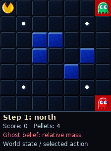

PacMan
======

Clear every pellet in a walled maze while ghosts hunt you. PacMan's own position
is known; the ghosts' positions are only observed through noise that grows with
distance, so the agent has to reason about where a ghost probably is rather than
where it was last seen.

It is the package's largest discrete state space, which makes it a useful stress
test for tree-search planners: the belief is over ghost positions, and a
planner that collapses it to a point estimate walks into ghosts.

What the agent sees and does
----------------------------

- **State** — a flat ``float64`` vector
  ``[pac_row, pac_col, ghost positions…, pellet_mask…, score, terminal]``.
  Construct one with ``env.make_state(...)`` and read it with
  ``env.get_pacman_pos``, ``env.get_ghost_positions``, ``env.get_pellets``,
  ``env.get_score``, ``env.get_terminal``. These are methods on the
  environment, not module-level functions.
- **Actions** (discrete) — ``0`` north, ``1`` east, ``2`` south, ``3`` west,
  ``4`` stay.
- **Observations** (discrete) — a tuple of one noisy ``(row, col)`` per ghost.
  Convert to and from a flat array with ``env.observation_to_array`` and
  ``env.array_to_observation``.

Rewards
-------

============================  ==============================================
Event                         Reward
============================  ==============================================
Every non-terminal step       ``step_penalty`` (default ``-1.0``)
Eat a pellet                  ``pellet_reward`` (``+10.0``)
Share a cell with a ghost     ``ghost_collision_penalty`` (``-100.0``)
Eat the last pellet           ``win_reward`` (``+100.0``)
Inside a dangerous area       ``-dangerous_area_penalty``
============================  ==============================================

.. warning::

   ``dangerous_area_penalty`` is a **positive magnitude that gets subtracted**
   here, the opposite of the convention in RockSample and Push, where the
   penalty is added and so must be passed negative.

Key settings
------------

.. list-table::
   :header-rows: 1
   :widths: 34 16 50

   * - Argument
     - Default
     - What it changes
   * - ``maze_size``
     - ``(7, 7)``
     - Grid size.
   * - ``walls``
     - 5 fixed cells
     - Maze layout.
   * - ``num_ghosts``
     - ``1``
     - Each ghost adds two dimensions to every observation.
   * - ``ghost_strategies``
     - ``["aggressive"]``
     - Per ghost: ``"aggressive"``, ``"patrol"`` or ``"ambush"``.
   * - ``ghost_coordination``
     - ``"independent"``
     - Also ``"coordinated"`` or ``"mixed"``.
   * - ``observation_noise_factor``
     - ``0.3``
     - How fast ghost-position noise grows with distance, capped by
       ``max_observation_noise`` (``1.5``).
   * - ``discount_factor``
     - ``0.95``
     -

``create_simple_maze_pacman(maze_size=7, num_walls=5, num_ghosts=1, seed=None)``
builds a randomized maze if you want variation across episodes.

An episode ends on a ghost collision, on clearing the last pellet, or on a
hazard hit when ``is_dangerous_area_hit_terminal=True``.

Minimal example
---------------

.. code-block:: python

   from POMDPPlanners.environments.pacman_pomdp import PacManPOMDP

   env = PacManPOMDP(maze_size=(7, 7), num_ghosts=1)

   state = env.initial_state_dist().sample(1)[0]
   east = 1
   observation = env.sample_observation(state, east)
   print(env.get_pacman_pos(state), "believes ghosts near", observation)

See also
--------

- :class:`POMDPPlanners.environments.pacman_pomdp.PacManPOMDP`
- Batched torch model:
  ``POMDPPlanners.environments.pacman_pomdp.pacman_vectorized_model.PacManVectorizedModel``
- :doc:`index` — the full catalog.
