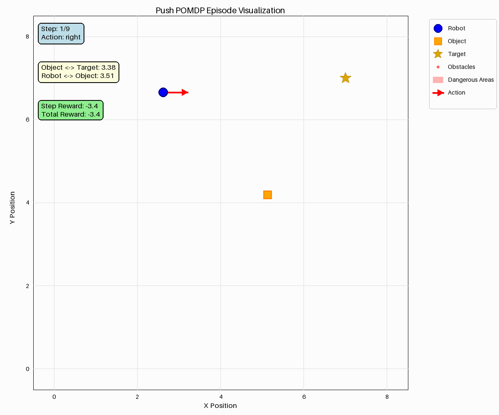
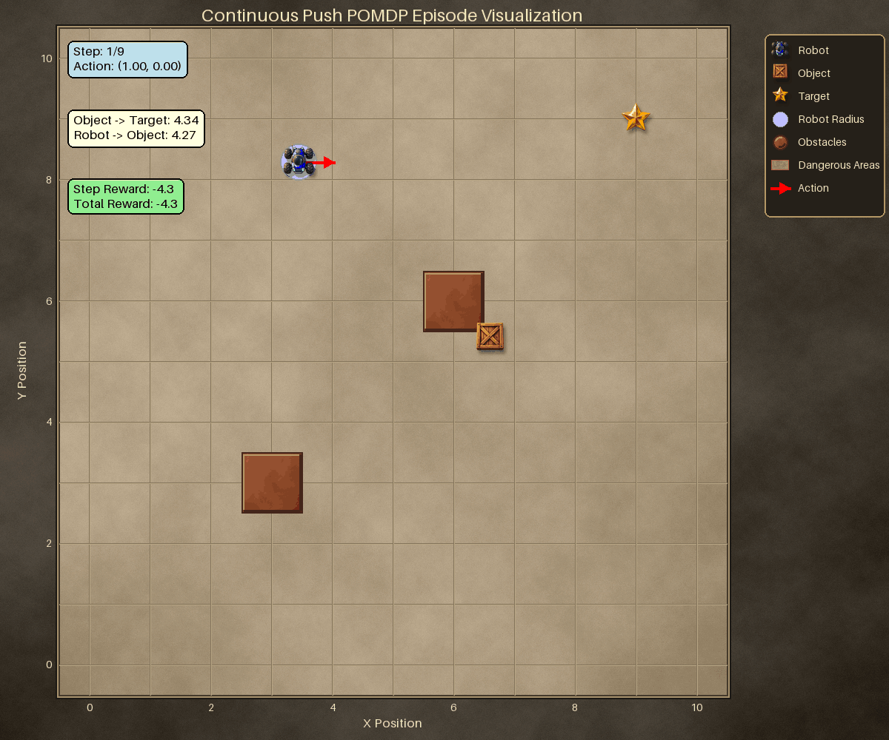

Push
====

A robot moves around a square arena and pushes an object towards a fixed target
corner. Only the object's position is observed noisily; the robot always knows
where it is. Pushing is indirect — you have to get on the far side of the object
first — so the agent must plan several steps ahead through a contact model.

Two variants:

- :class:`PushPOMDP <POMDPPlanners.environments.push_pomdp.push_pomdp.PushPOMDP>`
  — four grid moves.
- :class:`ContinuousPushPOMDP
  <POMDPPlanners.environments.push_pomdp.continuous_push_pomdp.ContinuousPushPOMDP>`
  — a circular robot and free 2-D displacement actions, with square obstacles.

.. note::

   ``ContinuousPushPOMDP`` and ``ContinuousPushPOMDPDiscreteActions`` are **not**
   in ``ENVIRONMENT_REGISTRY``, so ``get_environment("ContinuousPushPOMDP")``
   fails. Import the class directly.

What the agent sees and does
----------------------------

- **State** — ``np.ndarray`` of shape ``(6,)``:
  ``[robot_x, robot_y, object_x, object_y, target_x, target_y]``. The continuous
  variant appends a terminal-flag slot when either hazard-terminal flag is on.
- **Actions** — ``PushPOMDP``: ``"up"``, ``"down"``, ``"right"``, ``"left"``.
  ``ContinuousPushPOMDP``: a 2-D displacement vector, with Gaussian noise
  ``state_transition_cov_matrix``.
- **Observations** (continuous) — the same vector as the state, with only the
  object's position noised by ``observation_noise``. It is 7-D on a
  ``ContinuousPushPOMDP`` that carries the terminal slot.

The target sits at ``(grid_size - 1, grid_size - 1)`` and is not configurable.

Rewards
-------

============================================  =======================================
Event                                         Reward
============================================  =======================================
Every step                                    ``-distance(object, target)``
Object within 0.5 of the target               ``+100.0``
Robot inside an obstacle                      ``obstacle_penalty`` (``-10.0``)
Robot inside a dangerous area                 ``dangerous_area_penalty`` (``-10.0``)
============================================  =======================================

Penalties are **added**, so pass them negative.

Key settings
------------

.. list-table::
   :header-rows: 1
   :widths: 34 22 44

   * - Argument
     - Default
     - What it changes
   * - ``grid_size``
     - ``10``
     - Arena size, and therefore the target corner.
   * - ``push_threshold``
     - ``1.0``
     - How close the robot must be to move the object.
   * - ``friction_coefficient``
     - ``0.3``
     - How far a push carries.
   * - ``observation_noise``
     - ``0.1``
     - Object-position sensor noise — the partial-observability knob.
   * - ``obstacles``
     - ``None``
     - Centres of circular obstacles of radius ``obstacle_radius``
       (discrete, default ``0.5``), or ``(cx, cy, half_extent)`` squares
       (continuous).
   * - ``max_push``
     - ``2.0`` (continuous only)
     - Cap on the force delivered to the object, not on the action itself.
   * - ``robot_radius``
     - ``0.3`` (continuous only)
     -
   * - ``initial_state``
     - ``None``
     - ``None`` randomizes robot and object placement each episode, keeping the
       object at least 2.0 away from the target.

An episode ends when the object is within 0.5 of the target. On
``ContinuousPushPOMDP`` the absorbing terminal slot is checked first, so an
obstacle or hazard hit also ends the episode when the matching
``is_*_hit_terminal`` flag is on.

Minimal example
---------------

.. code-block:: python

   from POMDPPlanners.environments.push_pomdp import PushPOMDP

   env = PushPOMDP(discount_factor=0.95, grid_size=10)

   state = env.initial_state_dist().sample(1)[0]
   next_state = env.sample_next_state(state, "right")
   observation = env.sample_observation(next_state, "right")
   print(next_state, observation, env.reward(state, "right", next_state))

See also
--------

- Batched torch model:
  ``POMDPPlanners.environments.push_pomdp.push_vectorized_model.PushVectorizedModel``
  (wraps the discrete variant).
- :doc:`index` — the full catalog.
