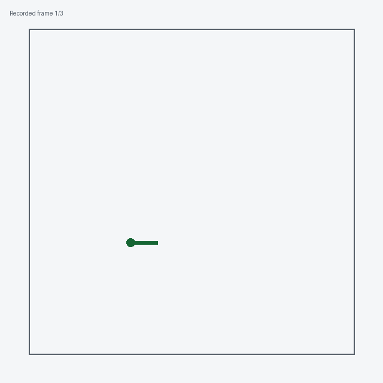

Realistic and experimental worlds
=================================

Four environments wrap an external simulator or dataset. They get a short entry
rather than a full guide because you cannot run any of them from a plain
``pip install``: each needs a separate install, and two need a server process.

They also differ from the rest of the package in kind. A benchmark environment
is both the world and the planner's model of it. These are **forward-only
adapters**: they can step the world, but they cannot serve as a planner's
generative model, and their ``transition_log_probability`` /
``observation_log_probability`` raise ``NotImplementedError``. You plan on a
separate *approximated model* and execute in the simulator — see
:doc:`../core/simulations`.

None of them appear in ``ENVIRONMENT_REGISTRY``, so ``get_environment`` will not
build them, and they are outside the cross-environment API conformance suite.

Formal definition
-----------------

These four are not POMDPs in the sense the rest of the catalog is. The tuple
:math:`\langle S, A, \Omega, T, O, R, b_0, \gamma \rangle` still describes
what they do, but :math:`T` is **not available in closed form and has no
density**:

.. math::

   s' \sim T(\cdot \mid s, a) \quad\text{is realizable, but}\quad
   T(s' \mid s, a) \ \text{is not computable}

:math:`T` *is* the simulator — a physics engine, a traffic model, or a
recorded log with reactive agents. Consequently
``transition_log_probability`` and ``observation_log_probability`` raise
``NotImplementedError``, and :math:`b_0` is a single realized reset rather
than a distribution you can sample repeatedly. You do not plan on these. You
plan on a separate approximated model :math:`\tilde{T}` whose density *is*
computable, and execute the chosen action here — see
:doc:`../core/simulations`.

Two further departures matter:

- **The world is stateful and forward-only.** There is one live state, and
  ``sample_next_state(s, a)`` advances it. Querying from any :math:`s` other
  than the live one raises. So :math:`T` is not even a function you may
  evaluate at arbitrary points — a tree search cannot expand here at all.
- **Termination is a property of the live world**, not a predicate on a state
  vector. ``is_terminal`` refuses a state other than the current one.

What *is* fully specified is :math:`S`, :math:`A`, :math:`\Omega` and
:math:`R`.

**Driving reward (CARLA and nuPlan).** Both use the same gym-carla-style
score. Let :math:`\mathrm{yaw}` be the ego yaw, :math:`e_{\mathrm{yaw}}` the heading error,
:math:`(v_x, v_y)` the velocity and :math:`d` the lateral offset from the
route. The along-route speed is

.. math::

   v_\parallel = v_x \cos(\mathrm{yaw} - e_{\mathrm{yaw}}) + v_y \sin(\mathrm{yaw} - e_{\mathrm{yaw}})

and with steering command :math:`u`:

.. math::

   R = \;&1.0 \cdot v_\parallel
   \;-\; 10.0 \cdot \mathbb{1}[v_\parallel > v_{\text{des}}]
   \;-\; 1.0 \cdot \mathbb{1}\big[|d| > d_{\max}\big] \\
   &-\; 5.0\,u^2
   \;-\; 0.2\,|u|\,v_\parallel^2
   \;-\; 0.1
   \;-\; \texttt{collision\_penalty} \cdot \mathbb{1}[\text{collision}] \\
   &+\; \texttt{success\_reward} \cdot \mathbb{1}[\text{destination}]

The last two terms are CARLA's; nuPlan carries the collision term without the
success bonus. Note :math:`R` rewards speed linearly and then penalizes
exceeding :math:`v_{\text{des}}` by a flat :math:`-10`, so the optimum sits
just under the limit; the :math:`|u| v_\parallel^2` term is what
discourages fast turns specifically rather than turning in general.

**Isaac Lab** is the one wrapper with a genuine
:math:`o = h(s) + \text{noise}` split — state read from the physics engine,
observation from a sensor buffer. Its :math:`R` passes through from the
underlying task, so there is no declared ``reward_range`` and no closed form
this page can state.

Racetrack
---------

:class:`RacetrackPOMDP
<POMDPPlanners.environments.racetrack_pomdp.racetrack_pomdp.RacetrackPOMDP>`
wraps HighwayEnv's ``racetrack-v0``. It is the easiest of the four to run — one
``pip install highway-env``, no server.

   Three states from a saved episode, rendered by the package from recorded
   ``StepData`` rather than by replaying the simulator. The blue line traces the
   ego vehicle across the first two action rows; the green marker and short line
   show its final successor position and heading, and the red marker shows the
   opponent recorded in that final state.

Its point is the **matched pair**: one dynamics, reward and track, with two
observation configurations selected by ``ObservationMode.MDP`` or
``ObservationMode.POMDP``. A planner's score gap between the two isolates the
cost of partial observability with everything else held fixed. No other
environment in the package is built for that comparison.

Discrete actions over control presets, continuous observations. ``highway-env``
is imported lazily and is declared in the ``dev`` extra, so CI exercises the
real simulator while a runtime install never loads it.

CARLA
-----

.. image:: ../images/carla_chase_camera.png
   :alt: Chase camera view of the ego vehicle in CARLA.
   :width: 480px

:class:`CarlaPOMDP
<POMDPPlanners.environments.carla_pomdp.carla_pomdp.CarlaPOMDP>` drives a live
CARLA server as the ground truth of an episode.

- **State** — a flat vector of width ``7 + 5·max_tracked_agents + 5 + 3``: ego
  ``[x, y, yaw, vx, vy, lateral_offset, heading_error]`` (yaw in **degrees**,
  CARLA's convention), then ``max_tracked_agents`` slots of
  ``[present, rel_x, rel_y, rel_yaw, rel_speed]`` in the ego frame, then a
  traffic-light slot ``[present, rel_x, rel_y, state_code, time_to_change]``,
  then a goal slot ``[goal_x, goal_y, route_progress_fraction]``.
- **Actions** (discrete) — an index into ``(throttle, steer, brake)`` presets;
  four by default.
- **Observations** — declared ``CONTINUOUS``, but actually a dict of sensor
  payloads. A default ``CarlaPOMDP()`` emits all five: ``gnss``, ``agents``,
  ``camera``, ``lidar`` and a privileged ground-truth ``traffic_light``.
  ``include_camera``, ``include_lidar`` and ``include_traffic_light`` all
  default to ``True``, so these are opt-**out**, not opt-in.
- **Rewards** — driving quality: ``+1.0 ×`` along-lane speed, ``-10.0``
  overspeed, ``-1.0`` out of lane, ``-5.0 × steer²``,
  ``-0.2 × |steer| × speed²``, ``-0.1`` per step, with ``-100.0`` on collision
  and ``+100.0`` at the destination.

Requires the ``carla`` Python API (imported lazily, and not declared in
``pyproject.toml``) and a running CARLA server, ``localhost:2000`` by default.
``CarlaServerPool`` manages several headless servers for parallel episodes.

Planner-side models, all pure NumPy with no CARLA import:
``KinematicCarlaModelPOMDP`` (kinematic-bicycle ego transition — prefer this
one), ``FactoredCarlaModelPOMDP`` (**its transition is a documented identity
placeholder**, so every action looks motionless to the planner) and
``DreamerCarlaModelPOMDP`` (a trained Dreamer RSSM behind a protocol).

Isaac Lab
---------

.. image:: ../images/isaac_lab_franka_reach.png
   :alt: The Franka reach task rendered in Isaac Lab.
   :width: 480px

:class:`IsaacLabPOMDP
<POMDPPlanners.environments.isaac_lab_pomdp.isaac_lab_pomdp.IsaacLabPOMDP>`
adapts any registered ``Isaac-*-v0`` task, and is the one wrapper with a genuine
``observation = h(state)`` split: state is read from the physics engine, the
observation from a sensor buffer such as a RayCaster LiDAR.

Alone among the environments, its space types are constructor arguments —
``action_space_type`` and ``observation_space_type``, both defaulting to
continuous. Reward passes through from the underlying task, so there is no
declared ``reward_range`` unless you supply one. Success rate needs an explicit
``success_termination_term`` or ``success_extractor``; the class refuses to
guess.

Two constraints shape how you can use it:

- **One ``SimulationApp`` per process.** The world and the planner's model
  cannot both be Isaac Lab in-process, and multiprocessing task managers cannot
  fork it.
- **``num_envs`` must be 1.** The constructor raises otherwise.

Needs Isaac Sim, Isaac Lab and a GPU; ``isaaclab`` and ``isaaclab_tasks`` are
imported lazily.

Planner-side models come in two stacks. The **factored** one —
``FactoredIsaacModelPOMDP`` with the task-specific ``UnicycleIsaacModel``,
``ManipulatorIsaacModel``, ``NavigationIsaacModel`` and ``LearnedIsaacModel`` —
carves the state into named channels and can express a real sensor. Prefer it.
The **one-space** ``IsaacLabModelPOMDP`` shares one space between state and
observation with ``observation = state + N(0, Σ)``; it is generic but cannot
express a hidden state variable, and its default reward model is ``None``,
meaning flat zero reward and undirected planning.

nuPlan
------

:class:`NuPlanPOMDP
<POMDPPlanners.environments.nuplan_pomdp.nuplan_pomdp.NuPlanPOMDP>` runs
closed-loop on recorded nuPlan scenarios, with the same world/model split and
the same driving-quality reward as CARLA. Ego state uses the same seven-slot
layout, with yaw in **radians** rather than degrees. Discrete actions over
``(acceleration, steering_angle)`` presets; observations are a
``{ego, agents}`` dict.

Needs ``nuplan-devkit`` (imported lazily, not declared in ``pyproject.toml``)
plus the nuPlan dataset and maps. Models: ``KinematicNuPlanModelPOMDP`` and
``FactoredNuPlanModelPOMDP``.

See also
--------

- :doc:`index` — the full catalog.
- :doc:`../core/simulations` — running a planner on an approximated model while
  the episode executes in the simulator.
