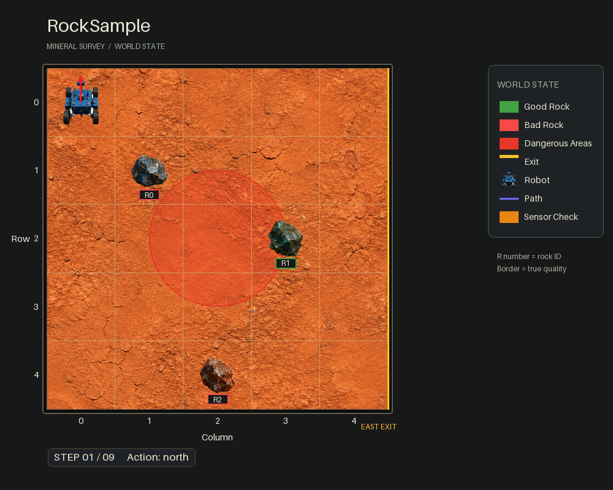

RockSample
==========

A robot on a grid must sample the good rocks and skip the bad ones, then leave
by walking east off the right-hand edge. Whether a rock is good is hidden; a
long-range sensor answers, but its accuracy decays with distance as
``exp(-distance / sensor_efficiency)``.

This is the standard long-horizon information-gathering benchmark. Getting a
good score means walking *towards* a rock to make its reading trustworthy, which
costs steps — the trade-off that separates planners that reason about future
observations from ones that do not.

What the agent sees and does
----------------------------

- **State** — a ``float32`` vector ``[robot_row, robot_col, rock_0, …,
  rock_{R-1}]``, each rock ``1.0`` good or ``0.0`` bad. Build one with
  ``create_rock_sample_state``; read it with ``get_robot_pos`` and
  ``get_rocks``. With ``is_dangerous_area_hit_terminal=True`` a terminal-flag
  slot is appended.
- **Actions** (discrete) — integers: ``0`` sample, ``1`` north, ``2`` east,
  ``3`` south, ``4`` west, and ``5 … 4+R`` to check rock *i*. So the action set
  grows with the number of rocks; readable names are in ``env.action_names``.
- **Observations** (discrete) — ``"none"``, ``"good"`` or ``"bad"``.

Rewards
-------

Terms are **added**, so the hazard penalty is passed as a negative number:

=========================================  ==================================
Event                                      Reward
=========================================  ==================================
Every step                                 ``step_penalty`` (default ``0.0``)
Sample a good rock                         ``good_rock_reward`` (``+10.0``)
Sample a bad rock                          ``bad_rock_penalty`` (``-10.0``)
Any check action                           ``sensor_use_penalty`` (``0.0``)
Move east off the right edge               ``exit_reward`` (``+10.0``)
Enter a dangerous area                     ``dangerous_area_penalty`` (``-5.0``)
=========================================  ==================================

Key settings
------------

.. list-table::
   :header-rows: 1
   :widths: 34 16 50

   * - Argument
     - Default
     - What it changes
   * - ``map_size``
     - ``(5, 5)``
     - Grid size.
   * - ``rock_positions``
     - ``[(0,0), (2,2), (3,3)]``
     - Number and placement of rocks. This sets the action-space size.
   * - ``sensor_efficiency``
     - ``10.0``
     - Larger means the sensor stays accurate further away, so the problem gets
       easier. (The docstring says 20.0; the code says 10.0.)
   * - ``dangerous_areas``
     - ``None``
     - Hazard cells. Adds a safety dimension on top of the information problem.
   * - ``is_dangerous_area_hit_terminal``
     - ``False``
     - Whether entering a hazard ends the episode.
   * - ``reward_model_type``
     - ``CONSTANT_HAZARD_PENALTY``
     - Also ``DISTANCE_DECAYED_HAZARD_PENALTY`` and
       ``ZERO_MEAN_HAZARD_SHOCK``. The last one cannot be combined with
       ``is_dangerous_area_hit_terminal=True``.
   * - ``discount_factor``
     - ``0.95``
     -

An episode ends when the robot exits east (its position becomes the sentinel
``(-1, -1)``), or on a hazard hit if that was made terminal.

Minimal example
---------------

.. code-block:: python

   from POMDPPlanners.environments.rock_sample_pomdp import RockSamplePOMDP

   env = RockSamplePOMDP(map_size=(5, 5), rock_positions=[(0, 0), (2, 2), (3, 3)])

   state = env.initial_state_dist().sample(1)[0]
   check_first_rock = 5
   observation = env.sample_observation(state, check_first_rock)
   print(env.action_names[check_first_rock], observation)

See also
--------

- :class:`POMDPPlanners.environments.rock_sample_pomdp.RockSamplePOMDP`
- Batched torch model:
  ``POMDPPlanners.environments.rock_sample_pomdp.rocksample_vectorized_model.RockSampleVectorizedModel``
- :doc:`index` — the full catalog.
