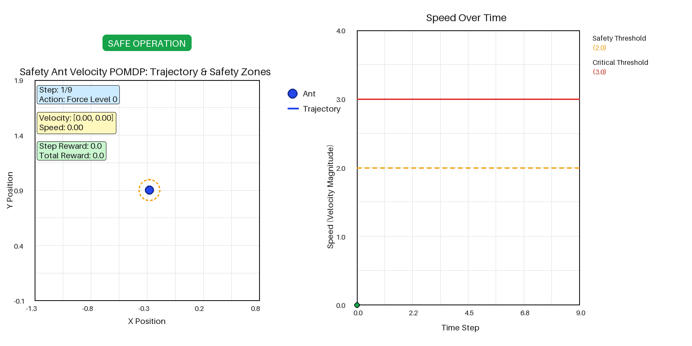

Safety Ant Velocity
===================

Move as fast as you can while keeping speed below a safety threshold, judging
your own speed only through a noisy sensor. Reward grows with speed and a heavy
penalty fires above the threshold, so the optimal behaviour sits just under a
line whose position you cannot see exactly.

Use it for constrained and risk-aware planners. It is the package's simplest
environment where the interesting question is not "what is the best expected
return" but "how much probability mass is over the limit".

.. note::

   Despite the name this is **not** a MuJoCo or Safety-Gymnasium wrapper. It is
   a self-contained 2-D point mass. Nothing in the package imports ``mujoco``
   or ``safety-gymnasium``.

What the agent sees and does
----------------------------

- **State** — ``np.ndarray`` of shape ``(4,)``:
  ``[position_x, position_y, velocity_x, velocity_y]``. The initial position is
  ``Uniform(-1, 1)`` in each axis with zero velocity.
- **Actions** (discrete) — ``0``–``3``, force magnitudes
  ``[0.0, 0.33, 0.67, 1.0] * max_force``. The force **direction is randomized
  by the transition kernel**; the agent chooses only how hard to push.
- **Observations** (continuous) — the 4-vector with diagonal Gaussian noise,
  ``position_noise`` on position and ``velocity_noise`` on velocity.

Rewards
-------

.. code-block:: text

   reward = speed * movement_reward_scale
            + safety_violation_penalty   if speed > safe_velocity_threshold

Defaults: ``movement_reward_scale=1.0``, ``safety_violation_penalty=-100.0``,
``safe_velocity_threshold=2.0``. ``reward_range`` is
``(safety_violation_penalty, safe_velocity_threshold * 1.5 * movement_reward_scale)``.

The reward is a function of the **current state only** — ``action`` and
``next_state`` are ignored.

Key settings
------------

.. list-table::
   :header-rows: 1
   :widths: 34 18 48

   * - Argument
     - Default
     - What it changes
   * - ``safe_velocity_threshold``
     - ``2.0``
     - Where the penalty starts, and (at 1.5×) where the episode dies.
   * - ``safety_violation_penalty``
     - ``-100.0``
     - How risk-averse the optimal policy is.
   * - ``velocity_noise``
     - ``0.2``
     - How well the agent can tell it is speeding. This is what makes the
       problem a POMDP.
   * - ``position_noise``
     - ``0.1``
     -
   * - ``max_force`` / ``mass`` / ``damping`` / ``dt``
     - ``1.0`` / ``1.0`` / ``0.1`` / ``0.1``
     - Point-mass dynamics.

An episode ends when speed exceeds ``safe_velocity_threshold * 1.5`` — ``3.0``
at defaults, a 50 % margin above the penalty line.

.. note::

   The default ``name`` is ``"SafeVelocityPOMDP"``, not
   ``"SafeAntVelocityPOMDP"``. That string reaches result filenames and
   ``config_id``.

Minimal example
---------------

.. code-block:: python

   from POMDPPlanners.environments.safety_ant_velocity_pomdp import SafeAntVelocityPOMDP

   env = SafeAntVelocityPOMDP(discount_factor=0.95, safe_velocity_threshold=2.0)

   state = env.initial_state_dist().sample(1)[0]
   full_thrust = 3
   next_state = env.sample_next_state(state, full_thrust)
   observation = env.sample_observation(next_state, full_thrust)
   print(next_state, observation, env.reward(next_state, full_thrust))

See also
--------

- :class:`POMDPPlanners.environments.safety_ant_velocity_pomdp.safety_ant_velocity_pomdp.SafeAntVelocityPOMDP`
- Batched torch model:
  ``POMDPPlanners.environments.safety_ant_velocity_pomdp.safety_ant_velocity_vectorized_model.SafetyAntVelocityVectorizedModel``
- :doc:`index` — the full catalog.
