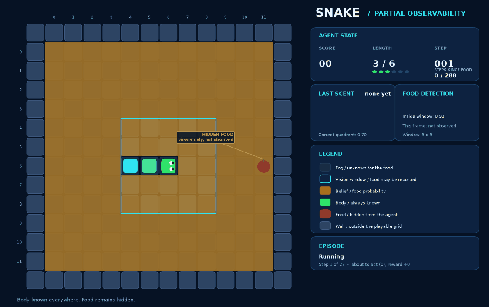

Snake
=====

``SnakePOMDP`` is the arcade game with the food hidden. The snake observes its
own body exactly and has to find food it cannot see, using a short-range vision
window and a noisy directional scent. The task is to grow to ``target_length``
without hitting a wall, hitting itself, or going too long without eating.

.. code-block:: python

   from POMDPPlanners.environments.snake_pomdp import SnakePOMDP, SnakeBelief

   env = SnakePOMDP(grid_size=12, target_length=10)
   belief = SnakeBelief.from_environment(env, n_particles=200)

The playable area is ``grid_size`` by ``grid_size`` cells. The walls are not
cells of the state: they sit just outside that area, so a head that steps off
the grid has hit one. The renderer draws them as a border around the board.

Ported from the MDP version in `snake-rl
<https://github.com/DragonWarrior15/snake-rl>`_, which is fully observable and
rewards the same events.

Formal definition
-----------------

Let :math:`n` = ``grid_size``, :math:`G = \{0..n{-}1\}^2` the playable cells,
:math:`L` = ``target_length`` and :math:`\kappa` = ``starvation_limit``
(default :math:`2n^2`).

**State space.** A body (head first), a food cell, a starvation counter and a
status tag:

.. math::

   s = \big(\varsigma,\; \mathbf{b},\; \phi,\; \nu\big), \qquad
   S = \mathcal{T} \times G^{\leq L} \times (G \cup \{\varnothing\})
   \times \{0..\kappa\}

with :math:`\mathbf{b} = (b_1, \dots, b_\ell)` the occupied cells,
:math:`\phi` the food, :math:`\nu` steps since food, and

.. math::

   \mathcal{T} = \{\textsf{RUNNING}, \textsf{WALL}, \textsf{SELF},
   \textsf{WIN}, \textsf{STARVATION}\}

The heading is not stored — it is recovered as :math:`b_1 - b_2`, so the body
alone determines where the snake can go next.

**Action space.** Relative to the heading, so reversing is unrepresentable:

.. math::

   A = \{\textsf{turn\_left},\; \textsf{straight},\; \textsf{turn\_right}\}
     = \{0, 1, 2\}

**Transition model.** Deterministic except for where the food respawns.
Rotate the heading, step, then resolve:

.. math::

   h' = \mathcal{R}_a(h), \qquad b'_1 = b_1 + h'

.. math::

   \mathbf{b}' = \begin{cases}
     (b'_1, b_1, \dots, b_\ell) & b'_1 = \phi \quad (\text{eat: tail held}) \\
     (b'_1, b_1, \dots, b_{\ell-1}) & \text{otherwise} \quad (\text{tail released})
   \end{cases}

Releasing the tail is what makes the cell it has just left safe to enter. The
counter resets on a meal, :math:`\nu' = 0` if eating else :math:`\nu + 1`, and
the status is decided in a fixed priority order:

.. math::

   \varsigma' = \begin{cases}
     \textsf{WALL} & b'_1 \notin G \\
     \textsf{SELF} & b'_1 \in \{b'_2, \dots\} \\
     \textsf{WIN} & |\mathbf{b}'| \geq L \\
     \textsf{STARVATION} & \nu' \geq \kappa \\
     \textsf{RUNNING} & \text{otherwise}
   \end{cases}

Wall and self are checked *first*: a snake that reaches its target length by
walking into a wall has still hit the wall. The only randomness is the
respawn, uniform over the cells the new body leaves free:

.. math::

   \Pr[\phi' = k] = \frac{1}{|G \setminus \mathbf{b}'|},
   \qquad k \in G \setminus \mathbf{b}'

and only when the step ate and did not win; otherwise :math:`\phi' = \phi`.

**Observation space and model.** A terminal state emits one fixed sentinel
reading. Otherwise the snake sees its own body exactly and the food through
two channels:

.. math::

   o = \big(\textsf{LIVE},\; q,\; \hat{\phi},\; \mathbf{b}'\big)

*Sighting.* The food is reported only when it is inside the Chebyshev window
around the head, and then only with probability :math:`p_{\text{det}}` =
``detection_probability``:

.. math::

   \Pr[\hat{\phi} = \phi'] = p_{\text{det}} \cdot
   \mathbb{1}\big[\lVert \phi' - b'_1 \rVert_\infty \leq r\big],
   \qquad \hat{\phi} = \varnothing \text{ otherwise}

With :math:`p_{\text{det}} < 1` a silent window is not proof the food is
elsewhere — absence of evidence stays weak evidence rather than a certainty.

*Scent.* A noisy quadrant reading. Let :math:`Q(\phi' - b'_1) \subseteq
\{0,1,2,3\}` be the quadrants compatible with the offset — two of them when the
food shares the head's row or column, one otherwise. With :math:`\alpha` =
``scent_accuracy``:

.. math::

   \Pr[q = k] = \begin{cases}
     \alpha / |Q| & k \in Q \\
     (1 - \alpha) / (4 - |Q|) & k \notin Q
   \end{cases}

which sums to one in the tie case too. At :math:`\alpha = 0.25` the scent is
pure noise; at :math:`1.0` it localises the food to a quadrant in one step.
The default :math:`0.7` makes several readings worth accumulating.

**Reward function.** A pure function of :math:`(s, a)` — eating and dying are
both settled by the deterministic half of the transition, and the respawn
cannot change either:

.. math::

   R(s, a) = \begin{cases}
     +1 & \text{the step eats} \\
     -1 & \varsigma' \in \{\textsf{WALL}, \textsf{SELF}, \textsf{STARVATION}\} \\
     0 & \text{otherwise, and for terminal } s
   \end{cases}

so :math:`R \in [-1, 1]`. Note a :math:`\textsf{WIN}` pays nothing beyond the
meal that caused it.

**Initial belief.** A fixed three-cell snake running west from the grid
centre, with the food uniform over every cell it leaves free:

.. math::

   b_0 = \delta_{\mathbf{b}_0} \otimes
   \mathrm{Unif}\big(G \setminus \mathbf{b}_0\big) \otimes
   \delta_{\nu = 0} \otimes \delta_{\varsigma = \textsf{RUNNING}}

The opening observation is the sentinel and nothing conditions on it: the
belief starts from this prior, and the first real reading arrives after the
first action.

**Discount.** :math:`\gamma` = ``discount_factor``, default :math:`0.98`.
Reaching the target takes hundreds of steps at :math:`n = 12`, so a shorter
horizon would flatten the difference between finding food soon and finding it
eventually.

**Terminal set.** Anything but :math:`\textsf{RUNNING}`:

.. math::

   S_T = \{s : \varsigma \neq \textsf{RUNNING}\}

Actions, observations and rewards
---------------------------------

Three actions, relative to the current heading: ``0`` turn left, ``1`` go
straight, ``2`` turn right. There is no reversing action, because a snake that
turned back on itself would walk into its own neck every time. The heading is
not stored in the state; it is the direction from the second body cell to the
head.

An observation is a flat tuple of integers with three parts:

* the **body**, reported exactly, head first. The body update is deterministic,
  so this tells the agent nothing it could not have computed — it is there so
  the state is fully recoverable from the observation history;
* **seen**, the food's exact cell when the food is inside the vision window (a
  square of Chebyshev radius ``window_radius``, clipped to the grid) and the
  window fires, which happens with probability ``detection_probability``. There
  are no false positives, so a sighting is conclusive;
* **scent**, one of four diagonal quadrants relative to the head, correct with
  probability ``scent_accuracy``. Food that shares the head's row or column is
  compatible with two quadrants, which split that probability between them.

Every terminal state emits one fixed reading instead, so a win and a wall hit
are indistinguishable through the sensor.

The reward is ``+1`` for eating, ``-1`` for dying to a wall, to itself or to
starvation, and ``0`` otherwise. Winning happens by eating, so it pays the same
``+1`` and nothing more. Eating and dying cannot both happen on one step: the
food is never on a body cell, so the step that reaches it can be neither a wall
nor a self hit.

Dynamics
--------

The body update is deterministic. The action turns the heading, the head steps
into the next cell, and the tail is released — unless the step ate the food, in
which case the tail stays and the snake grows by one. That pair decides a rule
that is easy to get wrong: stepping into the cell the tail has just left is
legal, but stepping into the tail while eating is a self hit.

The only random part of a transition is where the food respawns after it is
eaten: uniformly over the cells the new body does not occupy.

Wall and self hits are checked first, then the win, then starvation. A snake
that reaches its target length by walking into a wall has still hit the wall.
``starvation_limit`` defaults to ``2 * grid_size ** 2``.

Belief
------

The body is known and the food is one cell, so the belief is a categorical
distribution over the grid. ``SnakeBelief`` carries it exactly. When the
observed length grows, the tracked food was eaten and the prior restarts as
uniform over the new body's free cells; otherwise the previous distribution
carries over with the new head cell ruled out — not eating proves the food is
not where the head has just arrived. Either prior is then multiplied by the
likelihood of the sighting and the scent, and normalised.

A generic particle filter runs on this environment too, but it is lossy here:
a sighting rules out every cell but one, and a filter that happened to hold no
particle there would floor every weight and resample cells the sensor has
already excluded.

Metrics
-------

``task_completion_rate`` is the fraction of episodes that reached
``target_length``. ``ended_by_goal``, ``ended_by_failure`` and
``ended_by_timeout`` partition the episodes between winning, dying and running
out of the runner's steps. ``wall_death_rate``, ``self_death_rate`` and
``starvation_death_rate`` say which death it was, which matters because they
call for opposite fixes — a planner that walks into walls is searching badly,
one that starves is not searching at all. ``max_steps_since_food`` reports how
close an episode came to starving even when it did not.

Recorded visualization
----------------------

The board carries four layers. The snake is drawn head first with a colour
gradient down its body and eyes pointing along the heading; the agent observes
it exactly, so it is drawn at full strength everywhere. The cyan outline is the
vision window, and the cells outside it are fogged — the fog is about the
*food*, not the body. The amber glow is the belief: the posterior probability
that the food is in that cell, scaled to the brightest cell of that frame,
because the posterior starts spread over the whole grid and collapses onto one
cell the moment the window fires. The apple is drawn only so a reviewer can
check the other layers against the truth, and is labelled as hidden from the
agent.

Each frame shows the state the step was taken *from*, and the panel reports the
reading the agent chose on — the previous step's observation — rather than the
one its action is about to produce. A death is marked with a red cross over the
head and a starvation with an amber hourglass.

This is a renderer fixture replayed from a fixed action sequence with real
transitions and real belief updates. It demonstrates the renderer, not planner
performance.

No vectorized model
-------------------

Snake has no torch vectorized generative model, so it cannot be run under VOPP.
``PFT_DPW`` runs on the scalar ``Environment`` API and is what the environment's
QA pass uses.
