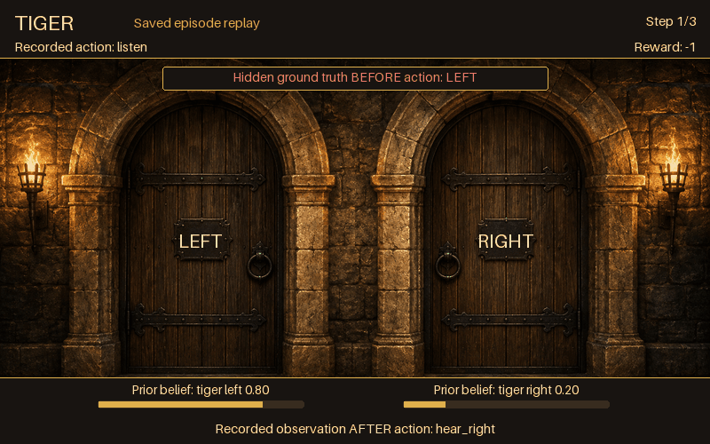

Tiger
=====

The classic two-door POMDP: one door hides a tiger, the other hides a prize.
Listening is cheap but only 85 % accurate, so the whole problem is deciding how
much evidence to buy before committing.

Use it as the first check on any new planner. A planner that opens a door
immediately, or that listens forever, is broken in a way you can see in three
episodes.

What the agent sees and does
----------------------------

- **State** — one of the strings ``"tiger_left"``, ``"tiger_right"``.
- **Actions** (discrete) — ``"listen"``, ``"open_left"``, ``"open_right"``.
- **Observations** (discrete) — ``"hear_left"``, ``"hear_right"``,
  ``"hear_nothing"``. Listening returns the correct side with probability 0.85.
  Opening a door always returns ``"hear_nothing"``; conversely
  ``"hear_nothing"`` never follows a listen.

Rewards
-------

======================  =========
Event                   Reward
======================  =========
Listen                  -1.0
Open the correct door   +10.0
Open the wrong door     -100.0
======================  =========

``reward_range`` is ``(-100.0, 10.0)``. The asymmetry is the point: at a
discount factor near 1 the optimal policy listens several times before acting.

Key settings
------------

``discount_factor`` is the only constructor argument that changes the problem,
and it is **required** — there is no default. The 0.85 listening accuracy and
the three rewards are constants in the class, not arguments.

An episode never ends on its own: ``is_terminal`` always returns ``False``, and
opening a door resets the tiger to a fresh 50/50 draw. Episode length comes from
the horizon the caller sets.

Minimal example
---------------

.. code-block:: python

   from POMDPPlanners.environments.tiger_pomdp import TigerPOMDP

   env = TigerPOMDP(discount_factor=0.95)

   state = env.initial_state_dist().sample(1)[0]
   # With n_samples=1 these return the value itself, not a list of one.
   observation = env.sample_observation(state, "listen")
   print(state, observation, env.reward(state, "listen"))

There is also a batched torch model,
``POMDPPlanners.environments.tiger_pomdp_vectorized_model.TigerVectorizedModel``,
for the vectorized planners.

See also
--------

- :class:`POMDPPlanners.environments.tiger_pomdp.TigerPOMDP`
- :doc:`index` — the full catalog.
