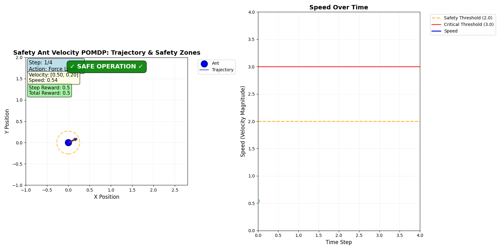
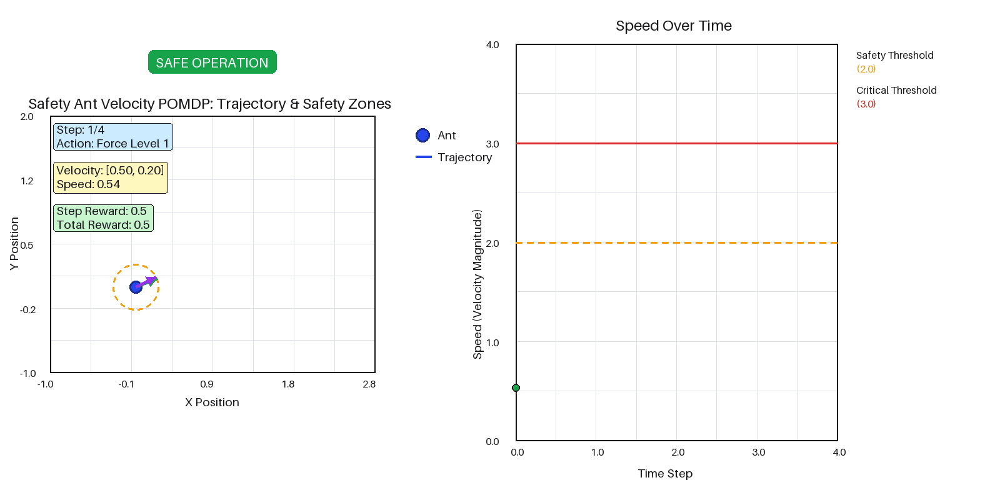

# Safety Ant visual redesign

Safety Ant now has a textured concrete world, a glossy blue ant with six legs and antennae, and a dark telemetry dashboard. The scene retains the force and velocity vectors, trajectory, safety thresholds, rewards, and terminal state. Terrain and sprite art are cached; one shared GIF palette preserves semantic colors and avoids per-frame palette generation. The public API stays the same.

The delivery run measured the same seed-42 four-state history with one warmup and five saved exports on ubuntu64, using one CPU thread and no GPU through the host gate. These timings include GIF encoding and saving. The terminal status banner sits above the plot so the step and action remain readable.

| Measurement | Matplotlib before | Pillow after |
| --- | ---: | ---: |
| Median export, seconds | 0.705519 | 0.115168 |
| File bytes | 137,807 | 2,290,211 |
| Frames | 4 | 4 |
| Dimensions | 1600×800 | 1600×800 |
| Frame duration, milliseconds | 1,250 | 1,250 |

The measured warmed median fell by 83.7%. The textured GIF is larger; timings include encoding and saving. Timing will vary by machine and episode length. Both examples use the same trajectory from the develop baseline. Captions follow wide and tall world plots; the dashboard remains separate from the world.

Before:

After:

The focused Safety Ant suite passed all 35 tests and focused pyright reported no errors. The regenerated golden GIF passed its hash comparison in the CI Docker base on ubuntu64. Black and whitespace checks pass.

The original full-suite run had 5,749 passes, 37 failures, and 5 errors outside Safety Ant, including sandbox-denied sockets and downloads. That run does not establish a clean full-suite baseline.
