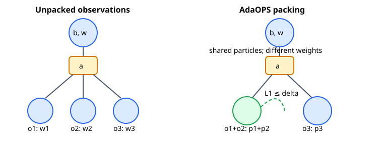

AdaOPS
======

Which problem does it solve?
----------------------------

AdaOPS is an online planner for partially observed problems with a generative
model and scoreable observations. Fixed-particle searches can lose accuracy as
weights collapse, while expanding every sampled observation makes the tree too
wide. AdaOPS changes both parts: it resamples only when weight disparity is
high, chooses the resample count with KLD sampling, and merges nearby sibling
beliefs. The paper proves high-probability convergence under its stated
assumptions; this implementation has correctness tests but no episode QA yet.

What does its value function mean?
----------------------------------

The objective is the finite-horizon discounted expected reward

.. math:: V_D(b)=\max_\pi\mathbb{E}_{s_0\sim b,\pi}\left[\sum_{t=0}^{D-1}\gamma^t R(s_t,a_t)\right].

Here ``b`` is the current state belief, ``D`` is the number of remaining
rewards, ``pi`` is a policy, ``gamma`` is the discount factor, and ``R`` is the
one-step reward. Larger values are better. Each tree node stores lower and
upper bounds on this value. Action bounds use the weighted immediate reward
plus ``gamma`` times the packed children. Search follows the largest upper
bound; the returned action has the largest lower bound.

What search structure does it build?
------------------------------------

The figure shows the defining change. Several sampled observations create
posterior weight vectors over shared successor particles. A posterior within
``delta`` L1 distance of an earlier sibling contributes its probability mass
to that sibling instead of creating another value-evaluation branch. A node
whose particle-count-to-effective-sample-size ratio crosses the configured
threshold is resampled.

Core benefits and limitations
-----------------------------

Adaptive particles spend more samples on dispersed beliefs, while packing
trades a bounded local bias for fewer observation branches. Both mechanisms
need model support: observations must have stable keys and likelihoods, and
KLD adaptation requires a user-supplied state-to-bin function plus a stable
identifier. No bins are inferred. Bounds must be valid for the configured
horizon. Search snapshots and numeric metrics are implemented and tested;
ten-episode planner QA is deliberately pending.

When to use it
--------------

Use AdaOPS when actions are discrete, observation likelihoods are available,
and ordinary particle trees either collapse weights or branch on too many
observations. Choose another planner when state bins have no defensible meaning,
the model cannot score observations, or packing bias is unacceptable. Expect
more belief bookkeeping in exchange for a narrower, better allocated search.

Revision note: Wu et al., NeurIPS 2021; author code ``JuliaPOMDP/AdaOPS.jl``
``main`` inspected 2026-09-08 under the MIT license. Local planner QA is not
part of this implementation job.
