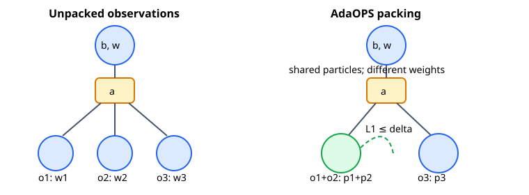

AdaOPS
======

Adaptive Online Packing-guided Search. AdaOPS plans online for problems with a
generative model and observations whose likelihood can be scored. A search
with a fixed particle count loses accuracy as the weight concentrates on a few
particles, and expanding every sampled observation opens one branch per
sample. AdaOPS changes both: it resamples a belief only when its design effect
exceeds a threshold, picks the number of particles with KLD sampling, and
merges sibling beliefs whose weights are within an L1 distance ``delta``.

The objective is the finite-horizon discounted expected reward

.. math:: V_D(b)=\max_\pi\mathbb{E}_{s_0\sim b,\pi}\left[\sum_{t=0}^{D-1}\gamma^t R(s_t,a_t)\right].

Here ``b`` is the current belief, ``D`` is the number of remaining steps,
``pi`` is a policy, ``gamma`` is the discount factor, and ``R`` is the one-step
reward. Each tree node stores a lower and an upper bound on this value. An
action's bounds are its weighted immediate reward plus ``gamma`` times the
bounds of its packed children. The search descends along the largest upper
bound; the returned action is the one with the largest lower bound.

The figure shows the packing step. Several sampled observations each give a
posterior weight vector over the same successor particles. A posterior within
``delta`` L1 distance of an earlier sibling adds its probability mass to that
sibling instead of opening another branch. A node whose particle count divided
by its effective sample size exceeds ``design_effect_threshold`` is resampled.

Notes
-----

- Original paper: Wu, C., et al. (2021). *Adaptive Online Packing-guided
  Search for POMDPs*. NeurIPS 34.
  Author code: ``JuliaPOMDP/AdaOPS.jl`` (MIT license), ``main`` inspected on
  2026-09-08.
- KLD particle sizing needs explicit state bins: pass a ``state_binner`` that
  maps a state to a hashable bin, plus a ``state_binner_id`` naming it. No
  bins are inferred. Without a binner, adaptation is off and resampling uses
  ``max_particles``.
- The bounds must be valid for the configured ``depth``. Pass
  ``lower_bound`` and ``upper_bound`` to supply your own.
- Packing trades a bias, whose size grows with ``delta``, for fewer
  observation branches. Choose another planner when that bias is unacceptable,
  when states cannot be grouped into bins, or when the model cannot score
  observations.
- Subclasses :class:`DESPOT <POMDPPlanners.planners.scenario_tree_planners.despot.DESPOT>`.
  The implementation has correctness tests; no episode QA results are
  committed yet.

Can I use?
----------

.. list-table::
   :header-rows: 1
   :widths: 34 14

   * - Capability
     - Supported
   * - Discrete actions
     - ✔️
   * - Continuous actions
     - ❌
   * - Discrete observations
     - ✔️
   * - Continuous observations
     - ✔️
   * - Cost constraints
     - ❌
   * - GPU
     - ❌

Example
-------

.. code-block:: python

   import numpy as np
   from POMDPPlanners.core.belief import get_initial_belief
   from POMDPPlanners.environments.tiger_pomdp import TigerPOMDP
   from POMDPPlanners.planners.scenario_tree_planners.adaops import AdaOPS

   np.random.seed(0)
   tiger = TigerPOMDP(discount_factor=0.95)

   planner = AdaOPS(
       environment=tiger,
       discount_factor=0.95,
       depth=5,
       name="ExampleAdaOPS",
       min_particles=10,
       max_particles=50,
       time_out_in_seconds=2.0,
   )

   belief = get_initial_belief(tiger, n_particles=50)
   actions, run_data = planner.action(belief)

Parameters
----------

.. autoclass:: POMDPPlanners.planners.scenario_tree_planners.adaops.adaops.AdaOPS
   :members:
   :show-inheritance:
