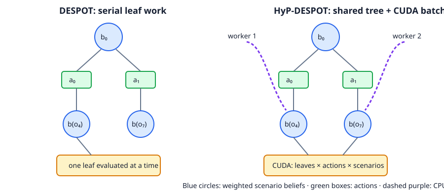

HyP-DESPOT
==========

1. Which problem does it solve?
--------------------------------

HyP-DESPOT plans online in a partially observed problem by fixing deterministic
scenarios and searching one sparse belief tree. DESPOT performs leaf work and
tree traversal serially. HyP-DESPOT keeps the shared tree on the CPU while it
batches expensive leaf transition, reward, observation, terminal, and bound
work on an NVIDIA GPU. CPU workers use scenario-aware PO-UCT and temporary
virtual loss so simultaneous traversals spread over useful branches. [Cai2018]_

2. What does its value function mean?
--------------------------------------

The implementation maximizes the finite-horizon discounted return

.. math:: V_D(b)=\max_\pi\;\mathbb{E}_{s_0\sim b,\,\phi}
          [\sum_{t=0}^{D-1}\gamma^t r(s_t,\pi(h_t),s_{t+1})].

``b`` is the current belief, ``D`` is the number of remaining rewards,
``pi`` maps an action-observation history ``h_t`` to an action, ``phi`` is the
explicit deterministic scenario-randomness stream, ``gamma`` is the discount,
and ``r`` is immediate reward. Larger values are better. Each action stores
lower and upper return bounds. PO-UCT adds a scenario-mass-weighted exploration
term only during traversal. The returned action has the largest backed-up lower
bound, so the exploration score cannot determine the final choice.

3. What search structure does it build?
----------------------------------------

All CPU workers share this topology. A worker marks its chosen observation
edge with virtual loss before it leaves the lock. The CUDA queue combines
several discovered beliefs, expands the leaf/action/scenario Cartesian axes,
then the CPU integrates each result exactly once and backs bounds toward the
root. The two sides use the same belief-action-observation topology; the marked
difference is parallel traversal and batched leaf evaluation, not a new tree.

4. Core benefits and limitations
---------------------------------

The GPU batch shares launch overhead across leaves, actions, and scenarios,
while CPU workers keep tree control flow off the device. Deterministic random
tensors make repeated scenario transitions reproducible. Numeric metrics and
opt-in JSON snapshots expose worker, batch, bound, virtual-loss, and topology
evidence.

The model must supply floating CUDA states, explicit scenario randomness,
integer observation keys, terminal masks, and CUDA leaf bounds. Only one GPU
(``cuda:0``) is supported. Continuous action environments need an explicit
finite expansion set. Within-step factored kernels are unsupported. CPU, MPS,
implicit model randomness, Python scalar states, and hidden device copies raise
``HypDESPOTCompatibilityError``. Local CPU contract tests pass; CUDA behavior
awaits the routed GPU QA job, so there is no episode-performance claim yet.

5. When to use it
------------------

Use HyP-DESPOT when model evaluation dominates planning cost, the model already
has deterministic batched CUDA kernels, and several scenarios and actions can
fill each batch. Choose DESPOT for scalar models or CPU-only machines. Choose a
continuous-action planner when no defensible finite action set exists. Expect
higher setup cost and GPU memory use in exchange for parallel leaf evaluation.

Configuration and evidence
--------------------------

``n_scenarios`` fixes root scenario count. ``n_traversals`` is the deterministic
work budget. ``n_workers`` controls CPU traversal threads and
``cuda_batch_size`` caps queued leaves. ``exploration_constant`` weights PO-UCT;
``virtual_loss`` spreads workers. ``scenario_seed`` identifies deterministic
random tensors. Set ``search_state_dump_dir`` to write immutable JSON snapshots.

Metrics cover traversals; CUDA batches, leaves, scenarios, and action rows;
mean/max batch size; queue, kernel, transfer, traversal, backup, and total time;
virtual-loss applications; lock wait; root bounds/gap; device index; and peak
allocated memory. Each value resets for every decision.

.. code-block:: python

   planner = HypDESPOT(
       environment=env,
       discount_factor=0.95,
       depth=8,
       name="gpu-search",
       n_scenarios=128,
       n_traversals=64,
       n_workers=4,
       cuda_batch_size=8,
       expansion_actions=env.get_actions(),
   )

Revision note: clean implementation from Cai et al., RSS 2018,
arXiv:1802.06215. Author code ``AdaCompNUS/hyp-despot`` was consulted by the
prior design job on 2026-09-08, but no license was found and no source was
copied. The exact upstream revision was unavailable because GitHub access was
blocked.

.. [Cai2018] Cai, P., Luo, Y., Hsu, D., and Lee, W. S. “HyP-DESPOT: A Hybrid
   Parallel Algorithm for Online Planning under Uncertainty.” RSS 2018.
