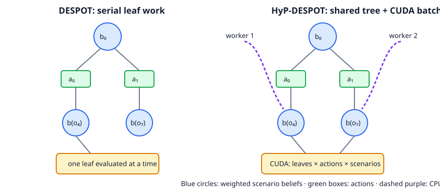

HyP-DESPOT
==========

Hybrid Parallel DESPOT. Like :doc:`../despot`, HyP-DESPOT fixes a set of
deterministic scenarios and searches the one sparse belief tree they induce.
DESPOT does its leaf work and its tree traversal one after the other.
HyP-DESPOT keeps the tree on the CPU and sends the leaf work —
transitions, rewards, observations, terminal checks and bounds — to an NVIDIA
GPU in batches. Several CPU worker threads traverse the tree at once, and a
temporary *virtual loss* on the branch a worker took pushes the other workers
onto different branches. [Cai2018]_

The planner maximizes the finite-horizon discounted return

.. math:: V_D(b)=\max_\pi\;\mathbb{E}_{s_0\sim b,\,\phi}
          [\sum_{t=0}^{D-1}\gamma^t r(s_t,\pi(h_t),s_{t+1})].

``b`` is the current belief, ``D`` is the number of remaining steps, ``pi``
maps an action-observation history ``h_t`` to an action, ``phi`` is the
deterministic per-scenario random stream, ``gamma`` is the discount, and ``r``
is the immediate reward. Each action stores a lower and an upper bound on this
return. Traversal uses PO-UCT, which adds an exploration term weighted by the
scenarios' probability mass. The returned action is the one with the largest
lower bound, so the exploration term never decides the final choice.

All CPU workers share one tree. A worker marks the observation branch it chose
with virtual loss before it releases the lock. The GPU queue collects several
leaves, expands every leaf, action and scenario at once, and the CPU then adds
each result to the tree once and backs the bounds up to the root. The tree has
the same shape as DESPOT's; what changes is parallel traversal and batched leaf
evaluation.

Notes
-----

- Original paper: Cai, P., Luo, Y., Hsu, D., & Lee, W. S. (2018).
  *HyP-DESPOT: A Hybrid Parallel Algorithm for Online Planning under
  Uncertainty*. RSS 2018. arXiv:1802.06215. This implementation was written from
  the paper; no author code was copied.
- Needs CUDA PyTorch and one NVIDIA GPU (``cuda:0``). CPU and Apple MPS raise
  ``HypDESPOTCompatibilityError``.
- The environment must expose ``hyp_despot_cuda_model``, or you pass
  ``model=``. The model is a
  :class:`~POMDPPlanners.core.environment.HypDESPOTCUDAmodel`: batched GPU
  kernels for scenario randomness, transitions, observations, rewards,
  terminal states, integer observation keys and leaf bounds. The belief's
  particles must be a floating ``[n, state_dim]`` tensor already on the GPU,
  with at least ``n_scenarios`` rows. The planner never copies data to the
  device for you, so a hidden copy cannot slow the search.
- The budget is ``n_traversals``, a fixed number of tree traversals.
  ``n_scenarios`` fixes the scenario count at the root, ``n_workers`` the CPU
  threads, and ``cuda_batch_size`` the leaves per GPU batch.
  ``exploration_constant`` weights PO-UCT and ``virtual_loss`` spreads the
  workers.
- Continuous-action environments need an explicit finite
  ``expansion_actions`` list.
- Set ``search_state_dump_dir`` to write a JSON snapshot of each search. The
  run data reports traversals, GPU batch counts and sizes, queue, kernel,
  transfer, traversal and backup time, virtual-loss count, lock wait, root
  bounds and gap, device index and peak GPU memory; every value resets on each
  decision.
- Use it when evaluating the model dominates planning time, the model already
  has batched GPU kernels, and enough scenarios and actions exist to fill each
  batch. On a CPU-only machine or with a scalar Python model, use
  :doc:`../despot`. Local CPU tests check the contract; no GPU episode results
  are committed yet.

Can I use?
----------

.. list-table::
   :header-rows: 1
   :widths: 34 14

   * - Capability
     - Supported
   * - Discrete actions
     - ✔️
   * - Continuous actions
     - ❌
   * - Action widening
     - ❌
   * - Observation widening
     - ❌
   * - Cost constraints
     - ❌
   * - GPU
     - ✔️

Example
-------

No built-in environment ships a HyP-DESPOT GPU model yet, so the example
defines a small one: a walk on a line where the reward is minus the distance
from 0. It needs an NVIDIA GPU to run.

.. code-block:: python

   import torch
   from POMDPPlanners.core.environment import SpaceInfo, SpaceType
   from POMDPPlanners.planners.scenario_tree_planners.hyp_despot import HypDESPOT

   class LineWalkModel:
       """Action 0 steps left, action 1 steps right; stay near 0."""

       supports_factored_step = False

       def __init__(self, device):
           self.device = torch.device(device)

       def scenario_randomness(self, scenario_ids, depth, seed):
           # The same ids, depth and seed always give the same noise.
           return torch.sin((scenario_ids * 31 + depth * 7 + seed).float()).unsqueeze(1)

       def sample_next_states(self, states, actions, random_values):
           step = (2 * actions - 1).to(states.dtype).unsqueeze(1)
           return states + step + 0.1 * random_values

       def sample_observations(self, next_states, actions, random_values):
           return torch.round(next_states + 0.5 * random_values)

       def rewards(self, states, actions, next_states):
           return -next_states[:, 0].abs()

       def terminal_mask(self, states):
           return states[:, 0].abs() >= 5

       def observation_keys(self, observations):
           return observations[:, 0].to(torch.int64)

       def leaf_bounds(self, states, remaining_depth):
           # A step moves at most 1.1, so the distance grows by at most that.
           d = remaining_depth
           lower = -(d * states[:, 0].abs() + 1.1 * d * (d + 1) / 2)
           return lower, torch.zeros_like(lower)

   class LineWalkEnvironment:
       name = "line-walk"
       config_id = "line-walk-v1"
       space_info = SpaceInfo(SpaceType.DISCRETE, SpaceType.DISCRETE)

       def __init__(self):
           self.hyp_despot_cuda_model = LineWalkModel("cuda:0")

       def get_actions(self):
           return ["left", "right"]

   planner = HypDESPOT(
       environment=LineWalkEnvironment(),
       discount_factor=0.95,
       depth=4,
       name="ExampleHypDESPOT",
       n_scenarios=32,
       n_traversals=16,
       n_workers=2,
       cuda_batch_size=4,
   )

   belief = torch.full((32, 1), 2.0, device="cuda:0")  # [n, state_dim] on the GPU
   actions, run_data = planner.action(belief)

Parameters
----------

.. autoclass:: POMDPPlanners.planners.scenario_tree_planners.hyp_despot.hyp_despot.HypDESPOT
   :members:
   :show-inheritance:

.. [Cai2018] Cai, P., Luo, Y., Hsu, D., and Lee, W. S. "HyP-DESPOT: A Hybrid
   Parallel Algorithm for Online Planning under Uncertainty." RSS 2018.
