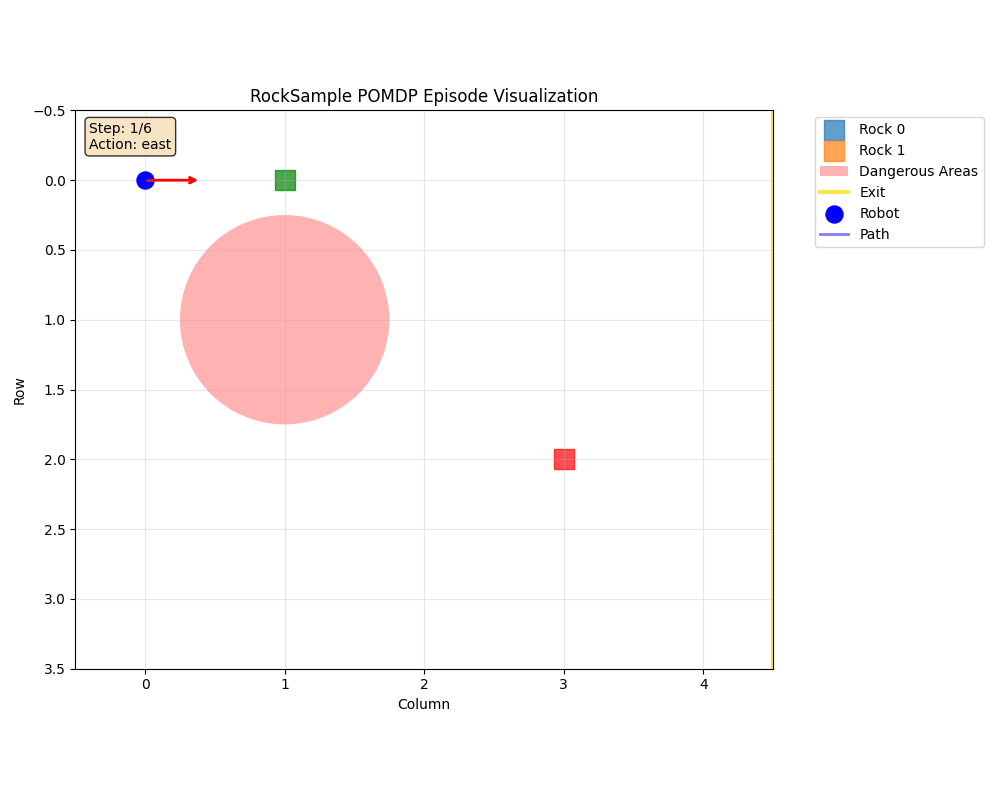
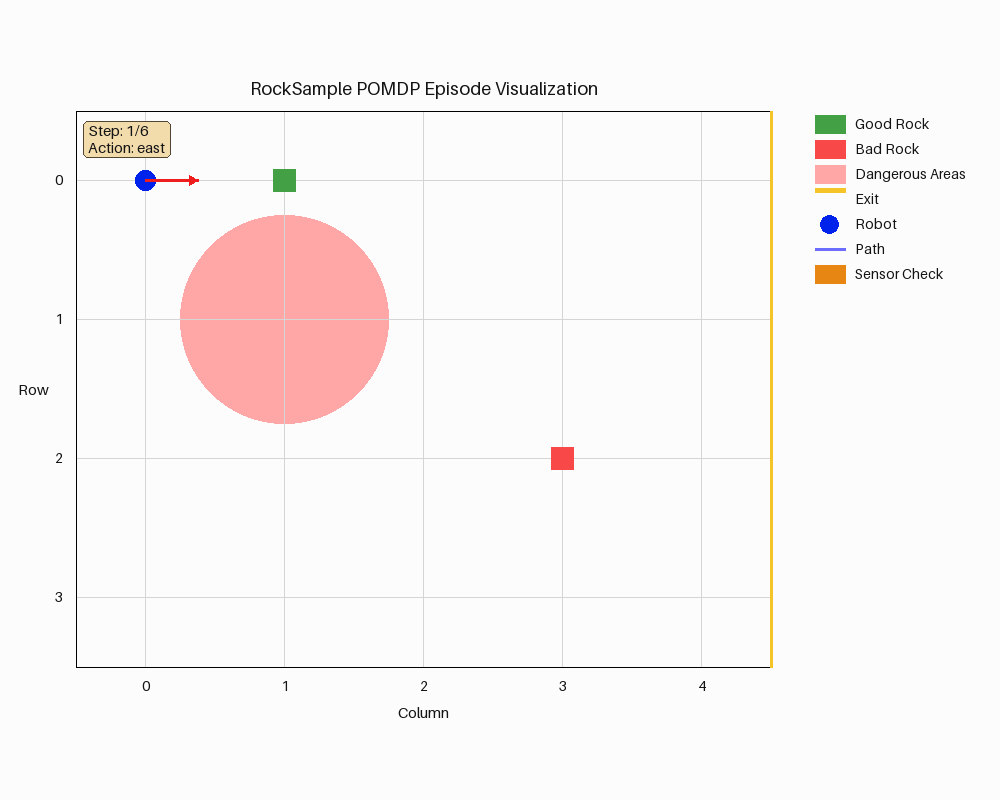

# RockSample visual redesign

RockSample now uses textured orange terrain, detailed rover and mineral sprites, translucent danger zones, a dark frame and legend, and rock-quality badges. Static art is cached; GIF saving does not call an image-generation service.

## Before and after

Both animations use the same six states and five actions: move east, check rock zero, sample a good rock, sample the depleted rock, move east, then terminal. Both are 1000 × 800, six one-second frames, seed 42. Before runs the renderer from develop commit `0111d3547f1be04dd960a49f83ba3c5157927ff8`.

### Before

### After

## Save speed

Measured on ubuntu64 in the CI dependency Docker image with one CPU thread, one warm-up, and five saved exports per renderer. The old renderer was executed, not estimated. Median save time fell from 0.596125 s to 0.155833 s (3.83× faster). More detailed pixels increase the GIF from 81,570 to 2,524,913 bytes.

| Renderer | Five save times, seconds | Median |
| --- | --- | --- |
| Develop | 0.599044, 0.597860, 0.595764, 0.589788, 0.596125 | 0.596125 |
| Redesigned | 0.159774, 0.155833, 0.155841, 0.155453, 0.154998 | 0.155833 |

## Checks

The CI Docker run passed 13 selected tests: focused renderer checks, golden-file comparison, and repeatability. Black passed for the three changed Python files. Pyright passed with zero errors and warnings on ubuntu64. A built wheel was installed into a temporary directory; all five PNG assets were present and loaded successfully.

The rendering retains row zero at the top, east exit, rock quality, movement and sensor cues, both sample results, terminal robot removal, and clipped danger areas. Environment dynamics, rewards, observations, and planner behavior are unchanged.

## Artwork

The built-in image-generation tool created a rover/ore atlas and orange-soil texture. An extraction edit removed cast shadows, but still returned a painted checkerboard; an offline boundary-connected matte pass removed it, and the four cutouts were saved at 256 px with alpha. Only those finished cutouts and terrain ship. Runtime decoding and resizing are cached. The GIF palette reserves 64 colors for sprite detail.

Fresh-process first-save samples, excluding imports: develop 0.617135 s; redesign 0.192615 s. These are single samples, distinct from the five-run warmed medians.
