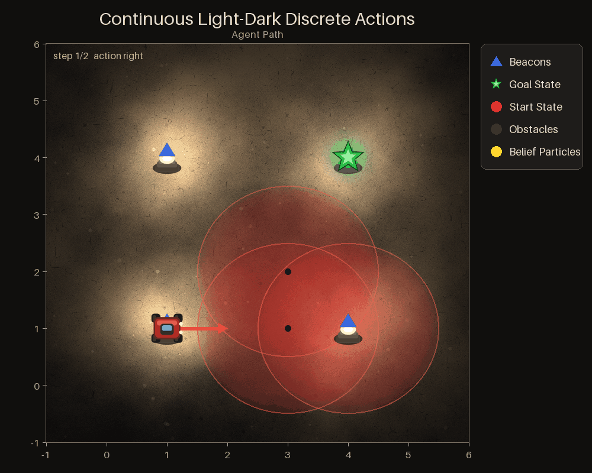
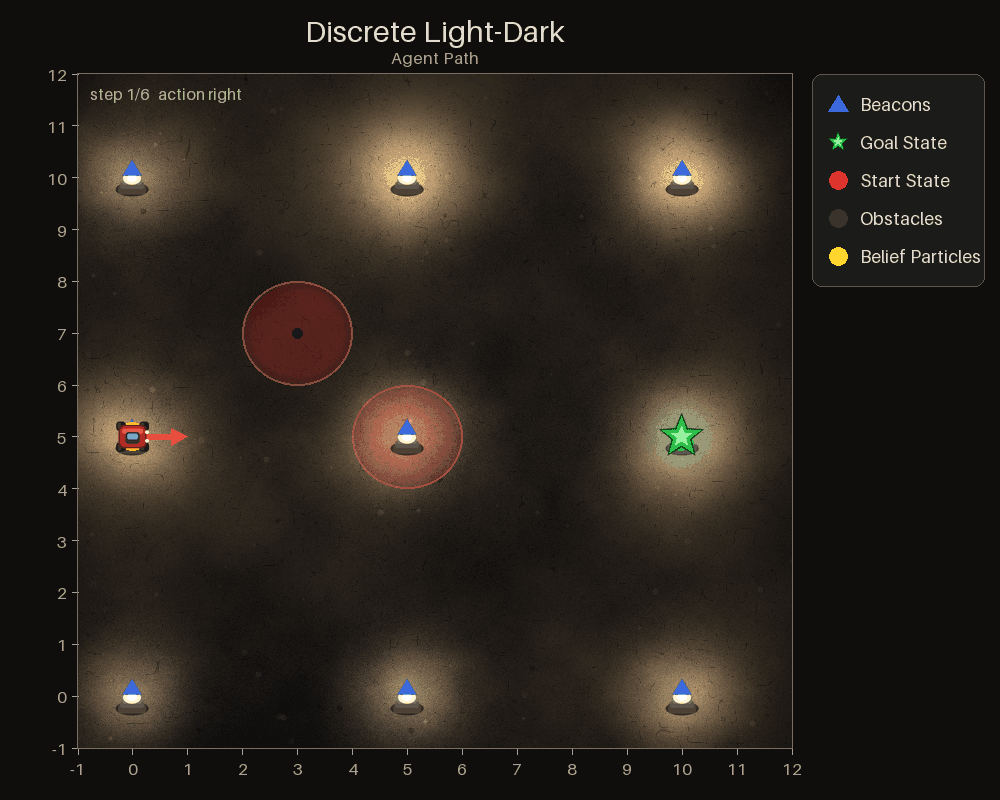
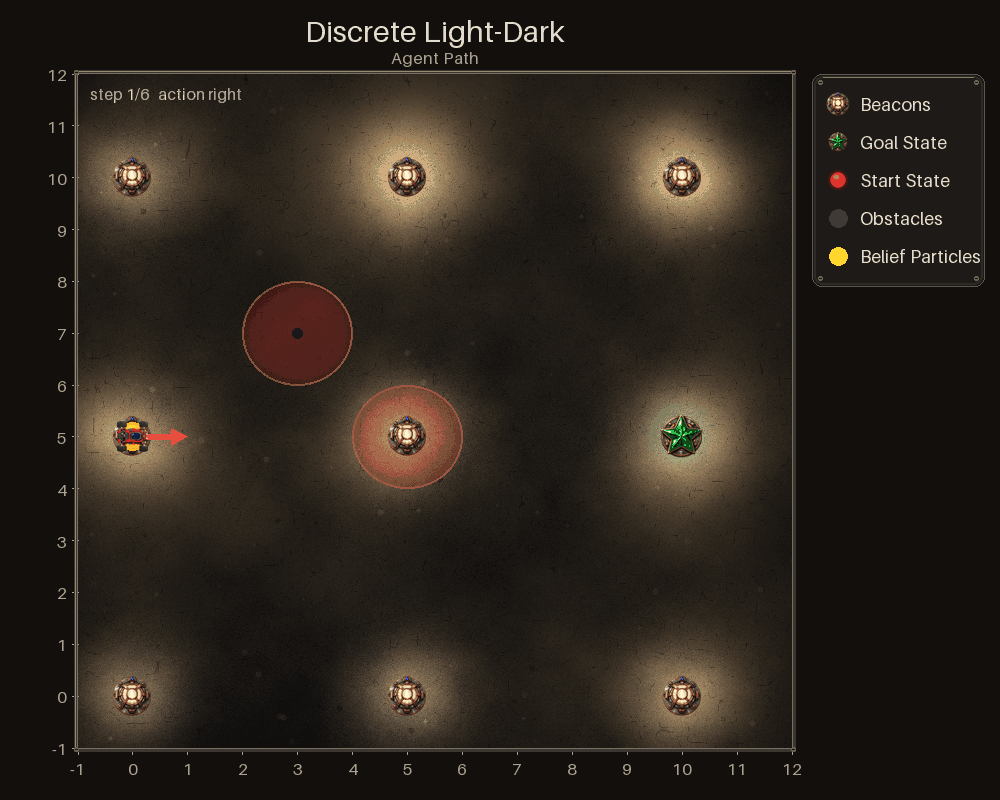
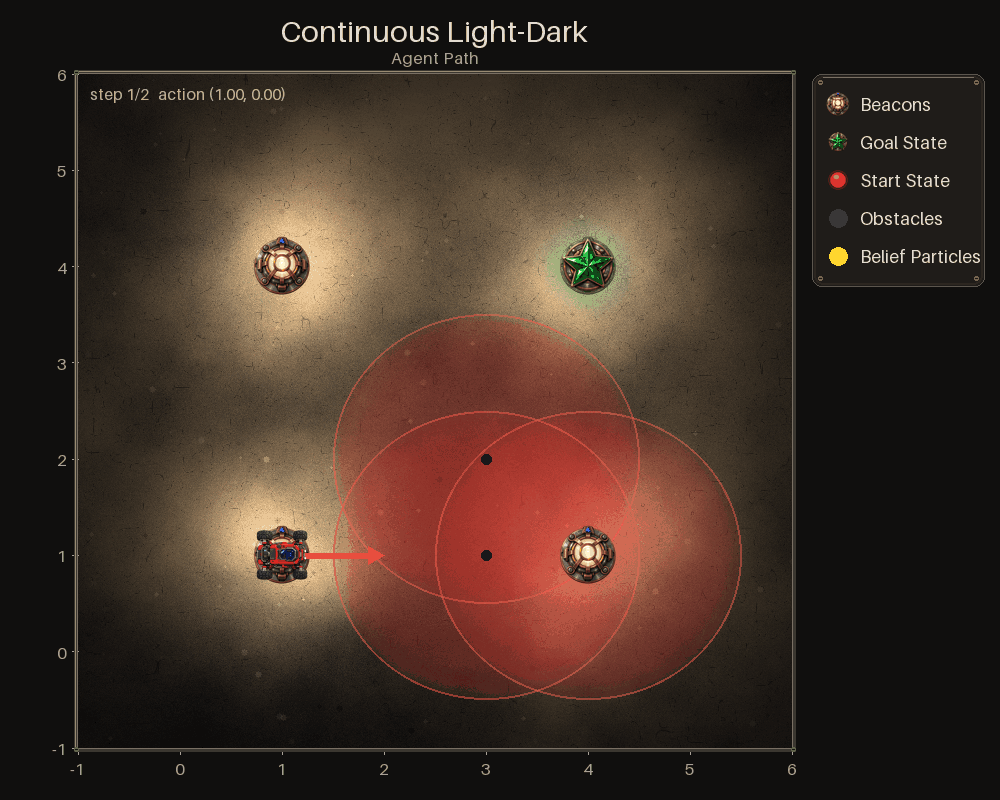

# Light-Dark art and export timing

All three Light-Dark wrappers share detailed rover, beacon and goal artwork. A metal plot frame and legend replace plain borders. Existing light fields, hazard disks, coordinates, beliefs, actions, heading and 500ms GIF frames remain unchanged.

## Matched saved GIFs

Before is develop `89738407`, the already-cached Pillow renderer, not the older Matplotlib implementation. Each pair uses the same saved seed42 history, geometry, belief sampling seed, frame count, dimensions and timing. No planner was run.

| Variant | Before | After |
| --- | --- | --- |
| Continuous state, discrete actions |  |  |
| Discrete state/actions |  |  |
| Continuous state/actions, cross-wrapper replay |  |  |

The continuous-actions example is **not an independently recorded continuous planner episode**. It replays the recorded `ContinuousLightDarkPOMDPDiscreteActions` path and beliefs through `ContinuousLightDarkPOMDP` on both versions. Direction labels are converted with the source environment's actual `action_to_vector`; geometry and states are identical. Seed43 replay also passed for every wrapper.

## Complete-save timing

Measured on the local Mac (Apple M5, native arm64, Python 3.12.14), one CPU thread and no GPU. This was an allowed fallback after ubuntu64 SSH timed out through both its Meshnet name and IP. Both versions ran on this same host. Times include the public `cache_visualization` call through disk write, not just frame drawing; imports and fixture loading are excluded.

| Seed42 fixture | Warm before | Warm after | Reduction | First save before | First save after |
| --- | ---: | ---: | ---: | ---: | ---: |
| Continuous state, discrete actions (2 frames) | 0.099275s | 0.070532s | 29.0% | 0.168969s | 0.142926s |
| Discrete state/actions (6 frames) | 0.145150s | 0.125675s | 13.4% | 0.224226s | 0.201050s |
| Continuous-actions replay (2 frames) | 0.099184s | 0.070419s | 29.0% | 0.173129s | 0.150287s |

Warm values are medians of five saves after one warmup. First-save values are single samples from a fresh process per version/variant, not medians. NumPy and Python RNGs are reset before every export because the existing renderer samples vectorized beliefs. All five repeated outputs were byte-identical within each version/fixture. Frames remain 1000×800 and 500ms each.

Smaller packaged PNGs avoid decoding 1254px art for sprites drawn at ≤64px. Half-size nearest-neighbour palette analysis avoids median-cutting the full 800,000px frame; output frames remain full-size and reserved overlay colours remain in the palette. Final GIFs are roughly 324–333KB, compared with 316–317KB before. Packaged sprite data totals about 178KiB rather than 6.1MiB.

## Checks

The 31 focused tests cover all three wrappers, output dimensions, deterministic rendering, cached assets, alpha, heading, geometry, hazards, path errors, and palette sampling on small/non-square images. Saved-GIF metadata confirms timing. Installed-wheel sprite loading and sdist inclusion passed. Black 23.12.1 and focused Pyright passed with no errors; four existing test-only type warnings remain.

The actual CI Docker image passed the regenerated golden hash test plus all 31 renderer tests (32 passed), with Black clean. It ran under local Colima amd64 emulation, one CPU and 3GiB RAM, because ubuntu64 was unavailable; no Docker timing is compared with native-Mac benchmarks. Own review and two independent Claude passes were completed. Oversized assets were fixed; packaging concerns were disproved by installed-wheel/sdist checks. Existing diagonal sprite clipping is unchanged and measured slightly lower with the new art.
